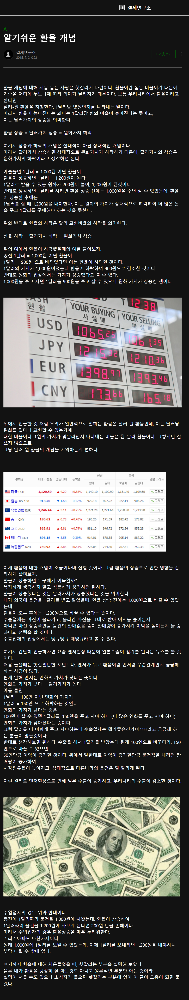
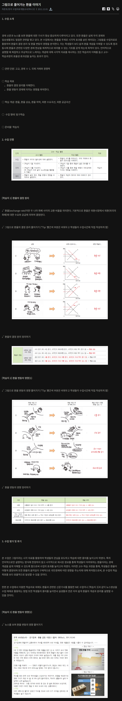

달러 환율을 원/달러로 주로 표시 ("원 per 달러"로 이해 가능), 즉 환율1000원이라고 하면 "1000원/달러"를 의미. 그리고 보통 원화 가치를 말하는것은 달러 대비 원화 가치를 말함

# 상황
## 환율이 떨어진 경우
1000원/달러 하던것이 500원/달러로 떨어졌을 때는 자국 화폐의 가치가 2배 상승했다는 의미, 이러한 요인으로는 여러가지의 원인이 있다.
1. 달러의 공급이 2배 증가 (달러 가치가 2배 하락)
2. 원화 공급량이 2배 감소
3. 경제력 변화
4. 외국인들의 국내 금융, 무역의 수요가 증가 (= 국내 원화 공급은 같은데 원화 수요가 증가하니 원화 가치가 증가하므로 환율이 떨어짐)

그리고 환율이 떨어지면 같은 돈으로 더 많은 달러를 얻을 수 있게 되므로, 달러 제품을 더 많이 수입하게 된다. 그리고 외국에서는 우리나라 제품의 가격이 오른것이나 마찬가지이므로 수출이 감소한다

그리고 원화나 달러의 가치 상승/하락은 서로간의 상대적인 관계에서 말하는것으로 절대적으로 보아서는 안됨

# 참고
- [토스](https://blog.toss.im/article/what-is-exchange-rate-1)
- [블로그](https://m.blog.naver.com/PostView.naver?isHttpsRedirect=true&blogId=xkxzxz&logNo=220407616645)
- [경제정보센터](https://eiec.kdi.re.kr/material/clickView.do?click_yymm=201512&cidx=1636)

# 참고 이미지 저장

  
클릭해서 펼치기

  
  ## 토스
  

  ## 블로그
  

  ## 경제정보센터
  

