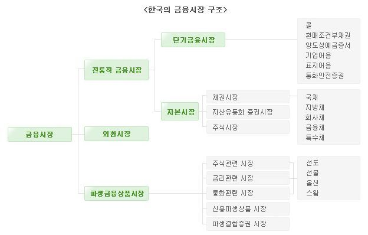
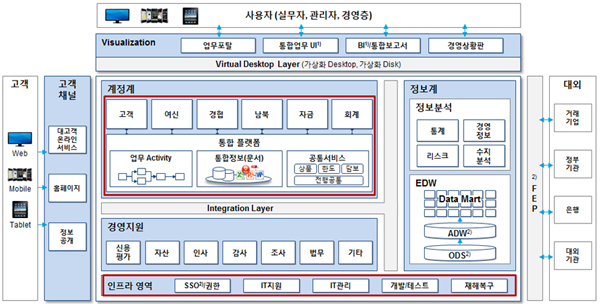
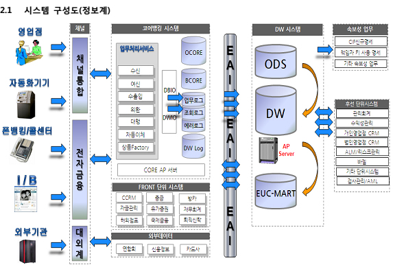
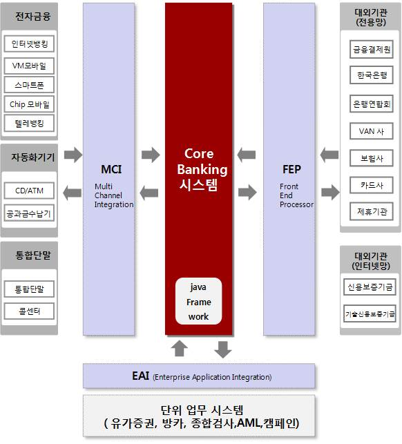
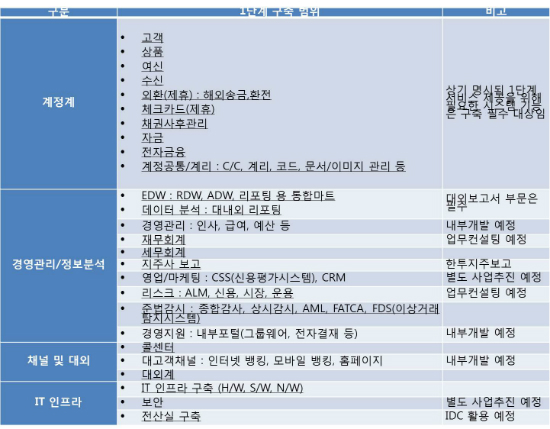
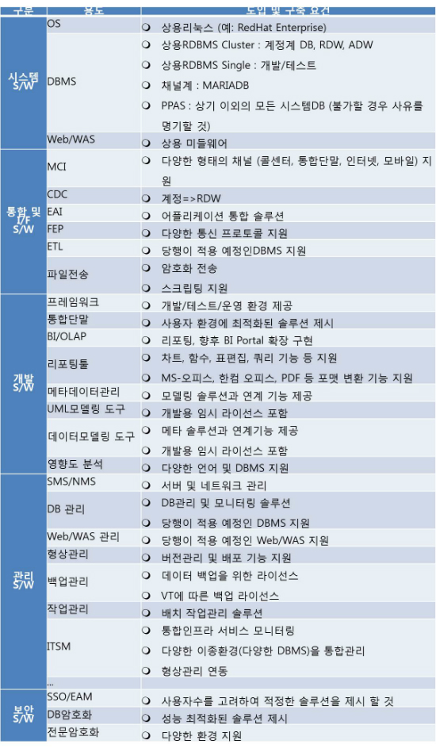

# 은행 IT 시스템
### 코어뱅킹
은행의 핵심 운영을 지원하는 중앙 정보 처리 시스템
- 외부와 연동이 중요: FEP (Front-End Processor, 금융결제원/카드대행사 등), EAI (Enterprise Application Integration, 단위 시스템), MCI(Multi Channel Interface, 채널계)
- 대부분의 아키텍처는 모놀리식으로 강한 결합으로 되어있음 (인터넷전문은행은 MSA 선호)

**한국의 금융시장 구조**  

- 고유업무: 저축해서 돈 빌려주기 (여신, 수신, 외환)
- 부수업무: 고유업무 동반 업무 (보증, 어음 인수)
- 겸영업무: 영업 (채권회수, M&A)

**시스템 구성도 예시**  

## 1. 계정계 (Core Banking)
> 계정을 관리하는 시스템

- 돈과 거래기록을 가지고 있음
- 데이터 수가 많음 (기본으로 수백억건)
- 데이터 백업 등 안정성 중요
- 정형화 된 데이터와 트랜잭션
- RDBMS 사용 (주로 안전한 Oracle DB)
- 컴퓨터 흐름: Mainframe -> Unix -> Linux
- 언어흐름: COBOL/Portran -> C -> Java (선택)

**업무**  
- **수신**: 고객으로부터 예금이나 적금을 받아 관리
- **여신**: 고객에게 대출을 제공하고 이를 관리
- **신탁**: 고객의 자산을 대신 관리하고 운용
- **카드**: 신용카드와 관련된 발급, 사용, 결제 등을 처리
- **외환**: 외국 통화의 매매와 관련된 업무를 처리
- **보험**: 고객에게 보험 상품을 판매하고 관련 서비스를 제공
- **대행**: 다른 기관이나 기업을 대신하여 금융 관련 업무를 수행

## 2. 정보계 (MIS, Management Information System)

> 고객정보와 분석정보 관리

- 한국에선 금융실명제 도입으로 많이 쓰이게 됨 
- 데이터 분석으로 전략을 수립, 상품을 만들 때 중요한 곳
- RDBMS 사용

**업무**  
- 데이터 관리
- 수익 관리
- 고객관계 관리
- 성과 관리
- 위험 관리
- 전략 수립 (정보연계, 통합조회, 통계분석)

## 3. 대외계 (EIS, External Interface System)
> 외부기관과의 연계업무를 처리

- 네트워크 중요 (금융공동망, 요즘은 오픈뱅킹 API, 토큰증권 테스트 중)
- 인터넷뱅킹, 텔레뱅킹, 펌뱅킹, ATM

**업무**  
- 은행간 송금
- 수표조회

### 운영계
> 운영 관련 시스템

**업무**  
- 통합관계
- 네트워크 모니터링

## 4. 백오피스 (기업업무 시스템)
> 은행을 움직이기 위한 시스템

**업무**  
- 회계
- 인사
- 세무 시스템

---

# 기술
- 안정성을 최우선 (은행은 신뢰가 가장 중요)
- 대부분 계정계에서는 안정성이 좋은 Oracle DB 사용 (이중화 등)
- 다른 곳에선 오픈소스DB 강화하여 사용
- 소수점 처리 민감
- 프로세스, 데이터 설계 중요 (쉽게 변경이 불가하므로)
- 유지보수에 용이한 Java 또한 사용
- 인터넷전문은행은 요즘 `계`를 나누기 보단 업무/기능 별로 분류도 함

# 코어뱅킹 구현체
- 전북은행, 카카오뱅크(계정계, 정보계): LG CNS가 MDA(Model driven Architecture)방식의 JAVA의 DevOn enterprise framework로 개발을 담당한 코어뱅킹 사용 (카카오뱅크는 전북은행과 계약으로 필요한 부분만 벤치마킹)
- K뱅크: 코어뱅킹글로벌(코어뱅킹 전문 회사)와 우리fis 회사가 JAVA로 구현

"시스템 구조 예시"

**전북은행 IT기술 아키텍처 구조**  

**카카오뱅크 요구명세서**  
</img>
</img>

---

# DevOn framework
Spring기반의 운영환경에서 고성능의 대용량 처리로 그 기술력이 검증된 프레임워크 (유지보수 서비스를 통해 시스템 특화기능과 공통 기능)

- [DevOn NCD](https://www.lgcns.com/business/dxsolution/devonncd/)
- [아직도 개발할 때 코딩하니? 이제 코딩없이 개발한다! 경이로운 DevOn NCD](https://wikidocs.net/book/5632)
- [기업 IT 프로젝트에 날개를 달아줄 ‘LG CNS DevOn’](https://www.lgcns.com/blog/cns-tech/solution/13026/)
- [‘DevOn’ LG CNS 아키텍처 솔루션은 무엇일까?](https://www.lgcns.com/blog/cns-tech/solution/13213/)
- [LG CNS DEVON FRAMEWORK](https://ebson.tistory.com/132)
- [\[DevOn MDD\] 컴포넌트 종류](https://velog.io/@jungmyeong96/DevOn-MDD)

---

# 참조
**코어뱅킹**  
- [서버와 계정계를 잇는 뱅킹API 개발자 이야기](https://brunch.co.kr/@kakaobankplus/28)
- [코어뱅킹팀 수신업무 IT 담당자 Steve의 이야기](https://kakaobank.recruiter.co.kr/appsite/company/callSubPage?code1=4000&code2=4500)

**구현체 뉴스**  
- [K뱅크 vs 카카오뱅크, IT시스템의 같은 점과 다른 점](https://byline.network/2016/04/1-116/)
- [카카오뱅크-LG CNS, 계약 안하나 못하나](http://m.bikorea.net/news/articleView.html?idxno=14530): 자세함
- [제3인터넷은행 토스뱅크, 전산시스템은 전북은행 모델 유력…LG CNS 우선협상](https://m.ddaily.co.kr/page/view/2020040808430060385)
- [카카오뱅크, 은행 IT에 새 이정표를 제시했다](https://m.dongascience.com/news.php?idx=19271)
