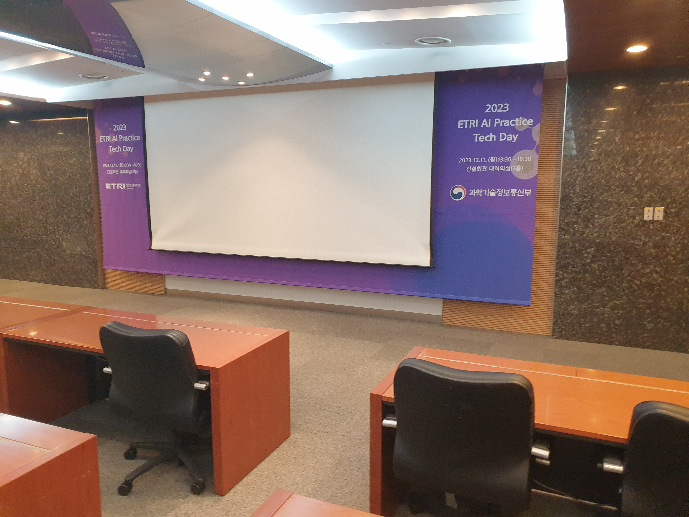
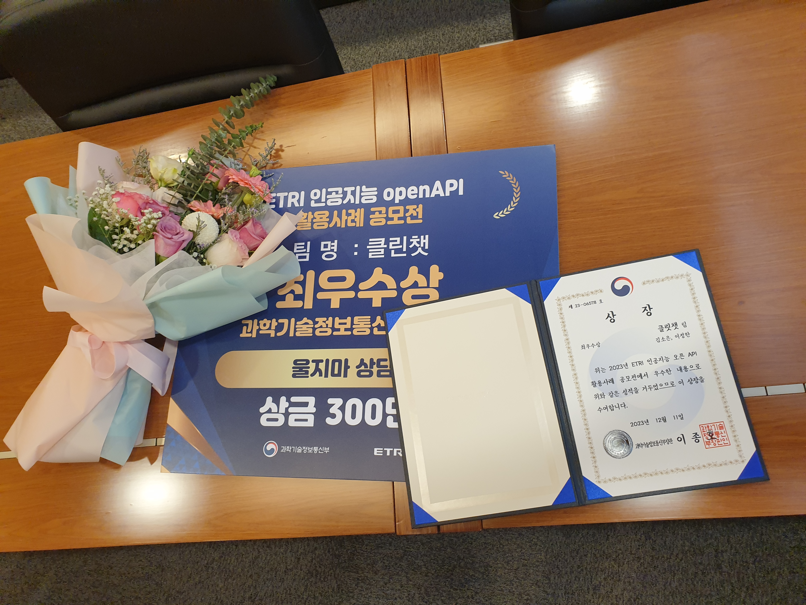

# ETRI에서 메모
- 진행했던 공모전 주제들 정리해놓기 (아이디어로 이어질 수 있음)
- 각각의 기술(언어모델, 메타버스, 블럭체인...)을 단편적으로 보지 말고 결합해서 보기

- 언어모델 아이디어 적용할 곳을 다른 기술(메타버스)와 결합해서 생각해볼 수 있음 (언어모델만 단순하게 적용하지 않고 다른 기술과 함께 적용)
> 교육: 메타버스 글래스 + 언어모델

- 교육에서 `어린` 학생들에게 기술을 미리 노출시키면, 어린시절의 경험이 성인이 되고 시장을 크기를 넓히는 역할을 함

- 현재 언어모델은 실제로 특정 개념에 대해서 `이해`를 하지는 않고, 해당 단어와 관련된 문장을 확률적으로 생성하는 것. 그러면 만약 이해가 특별히 필요한 단어가 있다면 사람처럼 그것에 대한 관련된 정보를 더 얻으려고 하면서 그거를 파일로서 저장해놓고, 관련 개념을 기억해야 할 때 읽는방법은 어떨까? (개념을 텍스트보다 이미지화 저장이 더 좋을까?)

---

- BERT: specialist (특화 목적)
- GPT: generalist (일반화 목적)

- GPT는 일반적인 지식을 학습되있어서 정보를 끄집어내는 프롬프팅이 중요해짐
- 언어모델은 도구가 필수로 필요할까? 내 생각엔 필수 (인간도 언어는 단지 표현의 도구로 쓰는것이고, 다른 숫자같은 작업을 하려면 정확한 계산기 도구를 사용하므로)

- LMM (Large Multimodal Model): 다양한 작업을 수행하는 모델
- KEByT5 GBST: ETRI에서 만든 크로스모달 모델

- 도메인 단어들을 마구잡이로 넣어놓고, 기술들도 단어로 넣어놓고, 연결작업 해달라고 해보기 (GPT)

---

# 생각
- 지금은 언어모델의 수정문제를 학습을 변형해서 할지, 도구를 쓸지 사람들(학계) 고민(시도)중.

---

# 사진

---

# 느낀점
### 발표에 관해서
발표 준비 자체가 절대적으로 부족했다. 이건 나의 게으른 습관 문제다. 다음에는 적어도 3일 전까지 리허설 마치는걸 목표로 해야 겠따.

그리고 발표를 시작하면서 처음에 떨렸는데, 나중에 갈 수록 말을 실제로 하면서 떨림이 슬슬 내려갔다.

다음에 시도해볼 전략은 `내가 친구에게 설명`한다고 생각하고 청중들에게 말을 더 편하게 해봐야 겠다.

내 생각에는 너무 딱딱한 발표는 이성적일지 몰라도, 감성적으로 움직이기 힘들다고 느껴졌다. 오늘 ETRI의 언어모델 팀장님?이 발표하시는데 들으면서 ppt자체에도 이성적으로 집중했지만, 감성적으로도 듣는데 편안했다. 일단 발표자의 마음이 편한하면 자연스럽게 편안하게 나오는것 같다.

### 시연의 중요성
복기해보면, 시연이 되게 중요하것을 느꼈따. 웹 페이지에서 음성통화하는걸 사람들을에게 더 잘 받아들이게 하려면, 직접 보이는게 제일이다. 그럴러면 실제 `핸드폰에서 웹페이지를 들어가서 스피커폰으로 통화`하는 액션을 보여주는게, 실제 생활에서 쓰일 수 있겠구나 라고 청중이 느끼게 할 수 있다고 생각됬다.