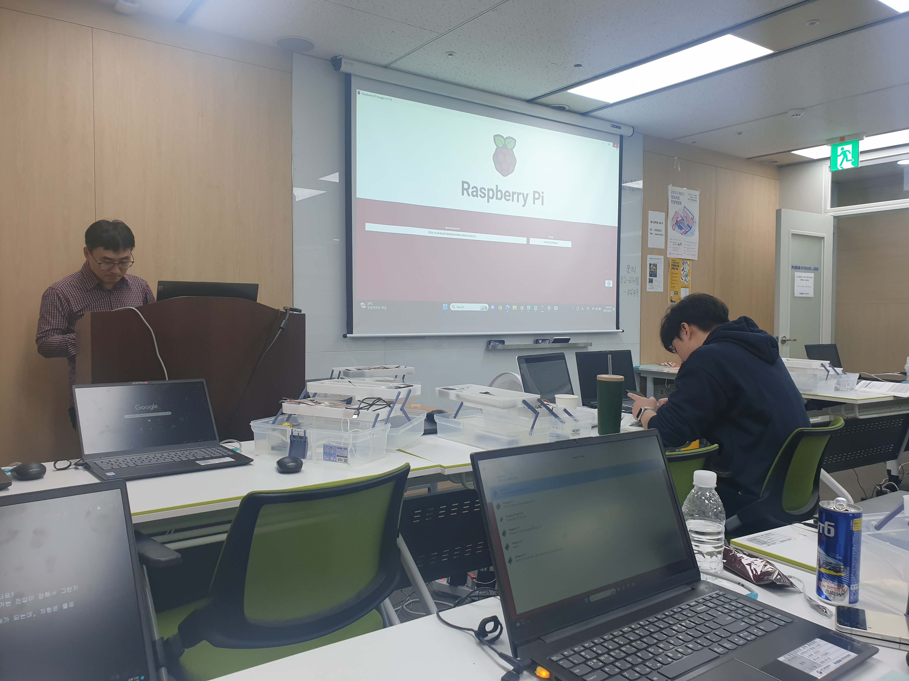
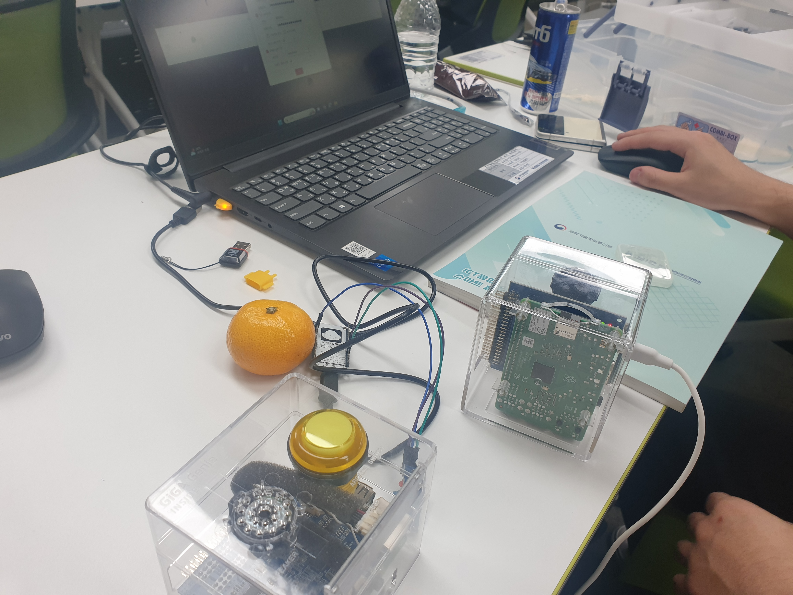

# 사진




# 아두이노
- 아쿠아 포닉스: 어류 및 기타 수생 동물을 기르는 양식과 흙없이 식물을 재배하는 수경 재배의 조합 (식물과 동물을 같이 키워서 순환 생태계로 키우는것)
- flash memory: 아두이노에 코드 올려놓는곳 (부트로더로 있음) (전원없어도 안날라감)
- SRAM: 빠름 (메인 메모리 용도) (전원 없어지면 내용사라짐)
- EEPROM: 환경 설정 같은 것들 (SRAM보다 느림)

# 수업
- 아두이노 기준으로 입력은 들어오는 것, 출력은 나가는 것
- `digitalWrite(pin)`는 출력핀에 5V를 넣어줌
- 전류는 전압차이로 흐른다 (전앞은 상대적인 개념) (-5V도 가능함: 높은곳에서 낮은곳으로 측정시)
- 아두이노 저항은 4색과 5색이 있음
- 저항은 방향이 없음
- 삼색 LED에는 각각 저항을 달아주지 않아도, 모듈안에 미니 저항이 들어있어서 전기만 연결하면 
- 아두이노 보드들은 전기가 약해서 실행중에 손으로 보드를 만지면 보드위의 회로끼리 합선이 되면서 고장나므로 전원이 들어간 상태에서 만지면 안됨

- 라즈베리파이 빨간불=전원, 초록불=데이터 입출력
- imager로 미리 ssh 연결을 준비가능, 자신의 (내부)ip를 hostname으로 설정가능
> 접속: ssh pi@{설정한hostname}

# 기타
- 코드는 자연어를 압축해서 논리적으로 정리해서 써놓은것으로, 적응하면 오히려 이해하기 편함
- 아날로그와 디지털의 구분은 `시간`
- 빔 프로젝터는 디지털이지만, 나오는 영상은 아날로그 (디지털로 아날로그를 구현하는것)
- 퓨즈는 가장 약한 저항으로, 전압이 너무 커지면 가장 약한 저항부터 터지게 설계한 것
- 프로그래밍언어는 대소문자 구분함

# 전기
- 전압(V): 물이 떨어지는 높이 (V)
- 전류(I): 물이 떨어지는 양 (암페아) (각 모듈에서 필요한 양 명시되어 있음)
- 저항(R): 물이 떨어질 때 방해하는 양 (옴)

**옴의 법칙**
- I = V / R (전류 = 전압 / 저항)
- V = IR (전압 = 전류 x 저항)
- R = V / I (저항 = 전압 / 전류)

```
1A = 1000mA
1KV =1000V
```
```
예시
V = 5V
I = 20mA
R = ? = 5000mV / 20mA = 250Ω
```

---

수학에서와 프로그래밍 언어에서 사용하는 `함수`에는 차이가 있음

**수학**
수학에서는 입력과 출력이 있어야 함
```
y = f(x)
```

**프로그래밍**
프로그래밍에서는 어떤 작업을 모아놓은 것을 단지 말함
```
y = f(x)
y = f()
f(x)
f()
```


# 질문
### 전기 흐르는 철선이 있을 때, 만지면 감전되나요?
- 사전 지식: 전기는 저항이 작은쪽으로 흐른다.
- 상황에 따라 다르지만, 만약 땅에 발을 닿아 있으고 저항이 철선보다적으면 전압차가 생기면서 전기가 흐름. (공중에서 만지면 전압차가 없어서 안흐름?)
- 새가 전선에 앉아도 감전이 되지 않는 이유: 전기는 저항이 작은쪽으로 흐르므로 새보다 전선의 저항이 더 작으므로 감전이 안되는 것

### 전기를 잘못 연결했을 때, 보드가 타는데 이거는 전압이 강해서 그런지 전류가 많이 흘러서 그런건지
전압은 상관없고, 전류가 큰것이 문제 (힘의 기준은 전류이므로 전류가 많이 흘러야 고장남, 정전기도 순간 전압은 크지만 전류가 잠깐 흐르므로 안죽음) (비유: 전앞이 아무리 물이 높이서 떨어져도 물양이 한번에 많이 안떨어지면 안 위험)

### 전앞과 전류는 수식이 물에 비유했을 때 이해가 되는데, 저항은 물로 비유했을 때 이해가 안되요
저항은 우리가 조절할 수 있는 것이므로 저항은 계산하는것은 의미가 없고, 전압과 전류에서 계산할 때만 쓰이는게 당연함
