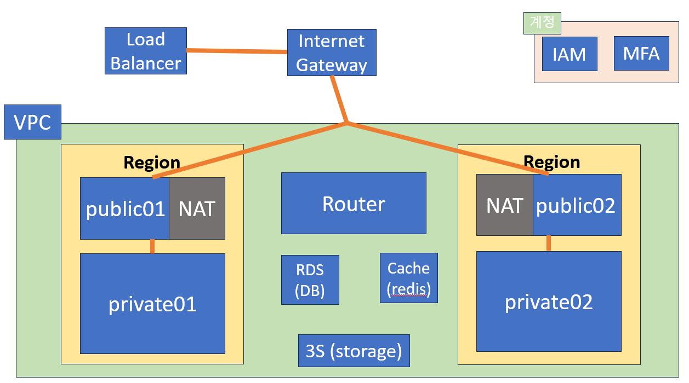

# 기타
- 외국(예. 미국) 대학교의 온라인 학위(석사, 박사)로 빠르게 졸업할 수 있음 (졸업하는데 약 거의 350만원 정도만 듬)
- 클라우드에서 CPU, RAM, NETWORK의 사용량 분석을 통해서도 어떤 프로그램을 실행중인지 추적할 수 있음 (그래서 일부러 노이즈 섞는 작업 필요)
- 모든건 그림과 관련이 있으므로, 메모리 값들을 꼭 산술적 분석보다는 이미지 전체 분석하는 방법도 있음 (d3.js: 이미지 분석이 의미있는 결과가 나오는 프로젝트들)
- 클라우드에서 각 컨테이너의 메모리 덤프를 뜨면 어떤것을 실행하는지 모두 알 수 있음 (성능문제: 변하는 부분만 변경, OS공통부분 제거)
- 클라우드라서 물리적인 선을 다루지 않고, sw적으로 관리할 수 있는 장점이 있음
- 각 클라우드는 장점이 다 있음: Azure(개발툴: 몇세대 앞서있다고 느껴진다고 함), AWS(확장성), GCP(오픈소스 연동)
- 모든 기술은 사용자의 입장에 따라서 사용될 수도 안될 수도 있다. (정부는 데이터를 외국 cloud에 보관하기 힘듬)
- 클라우드에서 인스턴스 뿐만이 아니라 DB와 같은 기능도 제공하는 이유는 클라우드라는 논리적인 공간에서 네트워크도 논리적으로 다루기 때문에 DB도 다양한 네트워크 연결과 제한이 필요하기 때문이다.


# 추천 책
- 사이트 신뢰성 엔지니어링 (Site Reliability Engineering: How Google Runs Production Systems): 클라우드 관리 명서?


# 실습

상황: 네트워크 문제 발생시 다른 백업 서버를 바로 활용할 수 있게 region을 따로 두고 네트워크는 가상네트워크로 묶어서 서로 한 네트워크에서 통신할 수 있게해서 사고를 방지함
- public: 외부에서 접근 가능한 웹서버
- private: 외부에 노출되면 안되는 내부 백엔드 서버
- NAT: 네트워크 아웃바운딩만 가능하게, 내부에서 외부로 갈때 공인IP 1개로서 동작
- Router: VPC에서 네트워크의 경로를 설정해줌 (NAT, internet gateway)
- Internet Gateway: 외부 인터넷과 VPC를 연결해주는 게이트웨이
- Jump server: 외부에서 AWS에서 접근할때, 점프서버를 통해서 안전하게 접근 (Jump Server에는 아무런 정보가 없어서 해킹당해도 됨)
- Load balancer: 많은 요청을 다양한 서버로 고르게 분산해주는 서버

---


# 오후 수업 (실습)
- AWS 실습
- root: 최고 권한, IAM: 사용자 계정
- VPC(Virtual Private Cloud): 클라우드 내 가상 네트워크 
- 서비스를 안정적으로 운영하기 위해서 서브넷을 독립적으로 만듬
- 인터넷 게이트웨이: VPC와 외부 인터넷이 통신할 수 있게 하는 곳 
- NAT(Network Address Translation): 사설 네트워크에서 공인된 IP 주소로 통신하기 위해 사용 (반대로는 어떻게??: )
- 0.0.0.0/0: 모든 네트워크 대역
- 점프서버(BASTION HOST): 입구 서버
- public은 인터넷 게이트웨로 나감, private은 NAT게이트웨이로 나감
- 라우팅 테이블: 네트워크에서 어떤 서브넷이 어떤 네트워크로 연결되있는지 구


```
- DB 비번: 
- 계정 key id: 
- 계정 access key: 
# web01 rails secret
# web02 rails secret
```

```
# ~/.ssh/config 
Host bastion
	Hostname 1
	User ec2-user
	IdentityFile ~/.ssh/aws-hhhh.pem

Host web01
	Hostname 1
	User ec2-user
	IdentityFile ~/.ssh/aws-hhhh.pem
	ProxyCommand ssh.exe bastion -W %h:%p

Host web02
	Hostname 1
	User ec2-user
	IdentityFile ~\.ssh\aws-hhhh.pem
	ProxyCommand ssh.exe bastion -W %h:%p

```
- 보통 주소를 말하면 end-point를 말함

- redis cache(rds): security-cache.eppalg.clustercfg.apn2.cache.amazonaws.com
- bucket(storage) name: security-storage-kisia
- database: security-db.1.ap-northeast-2.rds.amazonaws.com
- load balancer: security-elb-1.ap-northeast-2.elb.amazonaws.com


# 삭제
삭제는 모두 역순으로 작업 (종속성이 있으므로)
1. elastic cache: 작업 / 삭제 / 백업 안함 / 문구 입력 / subnet group 삭제
2. s3: bucket / 버킷 삭제 / 비우기 / 영구 삭제
3. rds: database / 작업 삭제 (스냅샷 x, 백업 x) / subnet group 삭제
4. ec2: instance / 모두선택 / 인스턴스상태-종료, 로드벨런스 삭제, 대상그룹, 탄력적IP
5. VPC: NAT 삭제 / 인터넷 게이트웨이 분리 후 삭제 / 탄력적IP 모두 릴리즈 / 서브넷 private, public 삭제 / 라우팅 테이블 / vpc 삭제
6. IAM: 사용자 삭제 / 사용자 그룹 삭제


--- 

# 질문
## 여러 노드 구성해서 관리 서버에서 각각 할당해주는 동작을 해주는 프로그램이 있나요? 또는 네트워크로 메세지를 전송하는 방식으로 할당해야 하나요?
- virtual manager
- openstack


