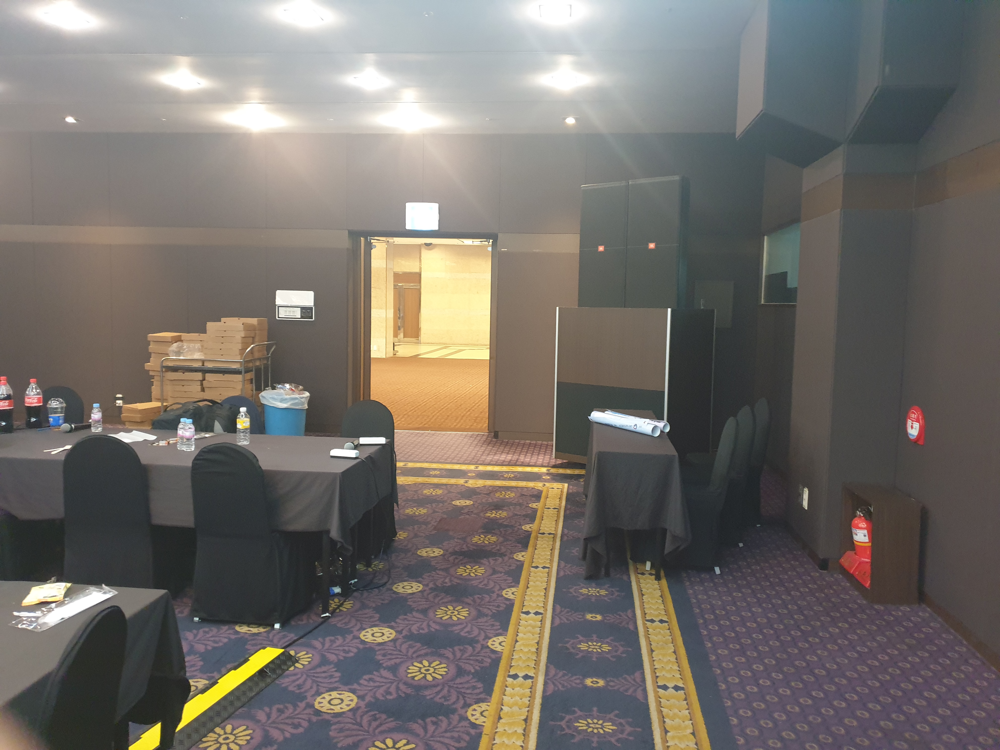
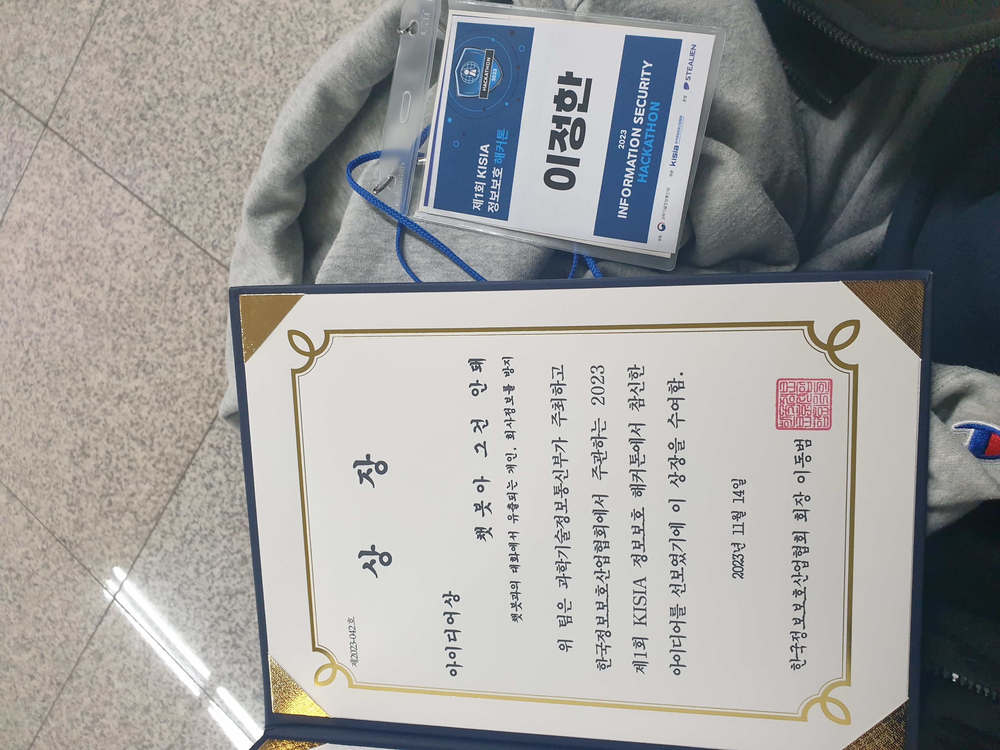
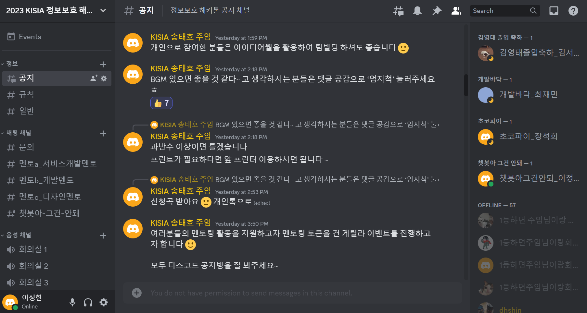

## 개발공간

## 결과발표 공간

## 상장

## 디스코드

## 느낀점
처음 접한 해커톤이었다. 주제가 미리 주어졌었지만 생각을 안하고 갔어서 처음부터 주제를 2가지 후보들을 만들면서 시작했다.

처음에는 챗봇 검색을 활용한 프로젝트내 라이브러리 취약점을 검색해서 보고서를 써주는 제품을 생각해봣지만, 일단 바로 시작하는것보다는 적어도 2~3개를 먼저 생각해본다음 고르기로 했다.

그러다가 7월 교육을 들으면서 알게된 객체명인식모델NER랑 챗봇을 결합시켜볼생각을 해봤다. 지금은 내가 언어모뎰에 꽂혀있어서 일단 뭐든지 언어모델과 결합할 시도를 했었다.

주제가 보안 이여서 보안+챗봇+객체명인식 이 합쳐져서 챗봇아 그건 안되라는 제품을 생각했다. 오후 2시 됨

그리고 고생이 시작됬다.
일단 구글api는 되게 복잡하다. 클라우드에 모두 연동이 되어있어서 이것저것 작업을 많이 했어야했다. 처음에 개발할때는 로껄이  디버깅이 빠르므로 로컬로 gcp-api-key를 다운받았는데, 계속 연결이 안됬다. 이 연결만 해결하고 나니 오후 7시 되버렀다...

나는 촉박해진 느낌이 들어서 바로 먼저 api 연결된거의 결과를 받았는데 또 단순한 json이 아니라 구글만의 객체였다. 그래서 또 문서를 찾아서 json으로 쓰기좋게 만드는데 인코딩 관련 문제가 있어서 멘토님과 같이 해결했다. 이때는 오후 11시쯤이었다

구글api 하나가 하루를 잡아먹었다.

그다믐엔 웹서버를 바로 만들기 시작했다. 이때부터는 시간이 너무 없다 생각해서 급하게 만들었다. 덕분에 일면식도 없고 난생 처음 만나는 에러들을 많이 접했다. 근데 또 에러가 왜 난지 어디서 난지 몰라서 정말 이상한 시도를 수없이 했다. 조금만 가능성이 있어보이는 해결법은 30분이 걸려도 다 해봤다. 덕분에 프로젝트 코드는 매우 아름다워져갔다...

그렇게 웹 에러들과 1대다수의 싸움을 외롭게 이어갔다. 새벽 3시쯤 전까지 솔직히 너무 힘들었다. 하지만 과거의 포기했던 경험들을 보면 희망을 놓으면 모두 끝이었다. 그래서 애써 일부러 희망을 만들어내서 내 마음을 속이는 수준으로 다스렸다. 솔직히 희망에 속아서 끝가지 안버리고 만들수있었다. 그렇게 3시에 마음속으로 한 3번 울면서 이도 안닦고 옆의 큰 베게로 그냥 쓰러졌다.

그리고 잠자면서 프로젝트가 동작이 하나도 안되서 ppt만이라도 만들까라는 생각을 엄청했다.

아침8시쯤에 다시 일어나서 동작이 되면 좋을거같아서 그냥 어제 풀던오류를 계속 봤다. 그러다가 송태호주임님이 친절하게도. .  아침을 먹으라해서 사실 안먹고싶었는데 오류를 계속보고있으면 화날거같아서 머리식힐겸 먹으러갔다. 근데 여기 고기가 너무 뻑뻑했다

그리고 다시 오류를 푸는도중 멘토링을 한번더 받고 1시간 쯤이 흘러 ner 하이라이팅 동작이 됬다. 이 프로젝트는 텍스트ner이 핵심이여서 나는 마음으로 또 다시 울었다. 기쁨의 눈물

이어서 어떻게든 오류랑 싸우다가 나의 억지력으로 웹을 끌어당겨서 어떻게든 ner관넌 기능을 동작시켰다. 이미지는 결국 안되서 ppt에 사진으로 넣었다. 더 쉬운 이미지를..

발표가시작됬다 그중 알바, 채용공고에서도 마약운반과 같은 보이스피싱을 탐지로한 조가 상당히 인상깊었고 내 이전의 김현서의 그림의 유사도로 보안을 해제하는 패스아트가 정말 인상깊었다. 그림의 유사도는 이미 있는 기술이지만 이것을 보안이라는 분야에 적용시킴으로서 완전 새로운 제품이 됬다. 게다가 보여준건 그림의 유사도 퍼센트가 끝이었다. 보안에 적용을 할 설명이 없었으면 그냥 단순한 그림 비교 프로그램이지만 정말 연결이 중요한거같다. 그점에서 나는 언어모델의 무한한 가능성이 있다고 생각한다.

그리고 나의 발표를 했다. 그렇다 떨었다. 그래도 할말의 75퍼정도는 했다. 마지막순서인데도 떨렸다

결과로 챗봇아 그건안돼 아이디어 상을 받앗다.

끝내기 전 나는 어떤 분의 말이 정말 강력하게 와 닿았다.

학생들에게 지금은는 상을 받는게 가장 중요하게 느껴지겠지만 시간이 지나면, 이번에 겪은 밤샘 경험과 팀원들끼리의 소통하면서 겪은 경험들이 회사에 가서 경쟁력이 될 것이라는...

다음에는 스스로 나서서 팀에 잘 녹아드는 연습을 해보겠다.