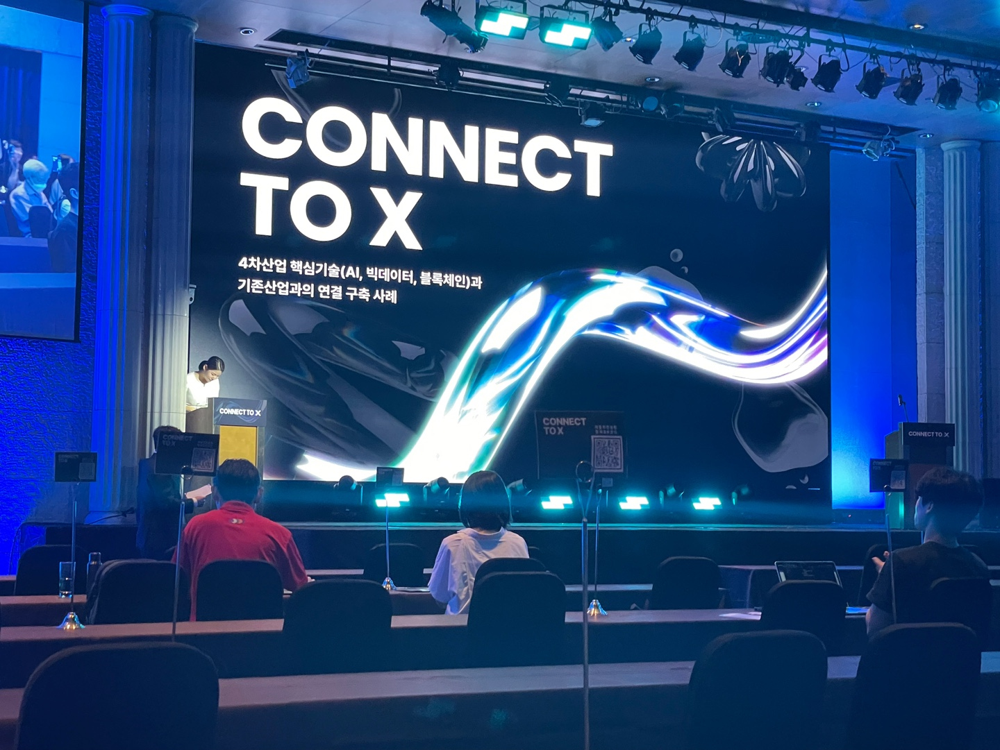
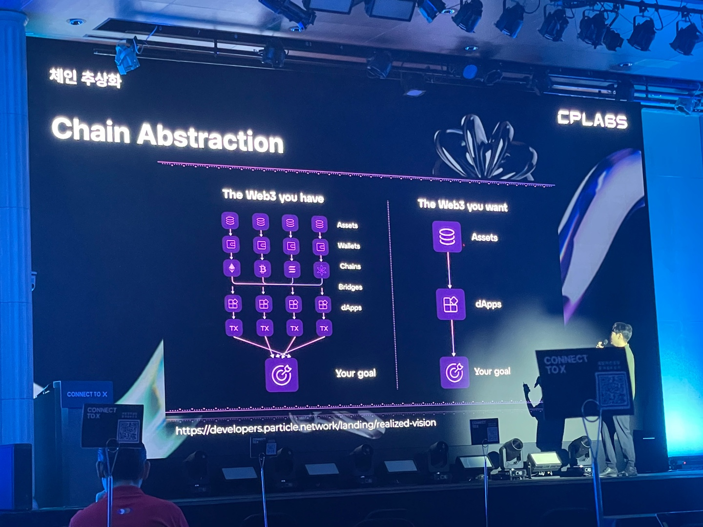
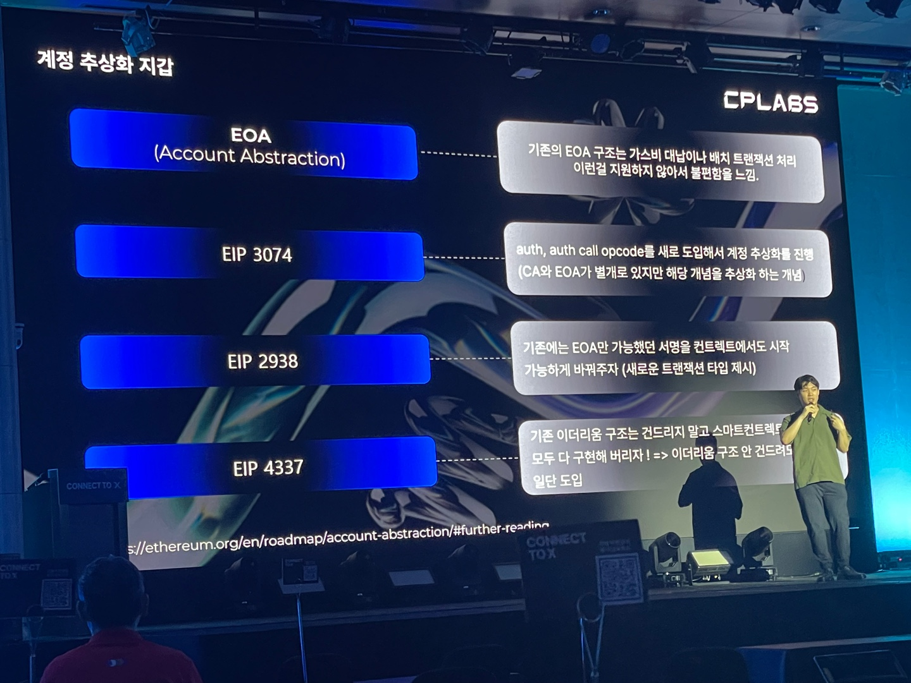
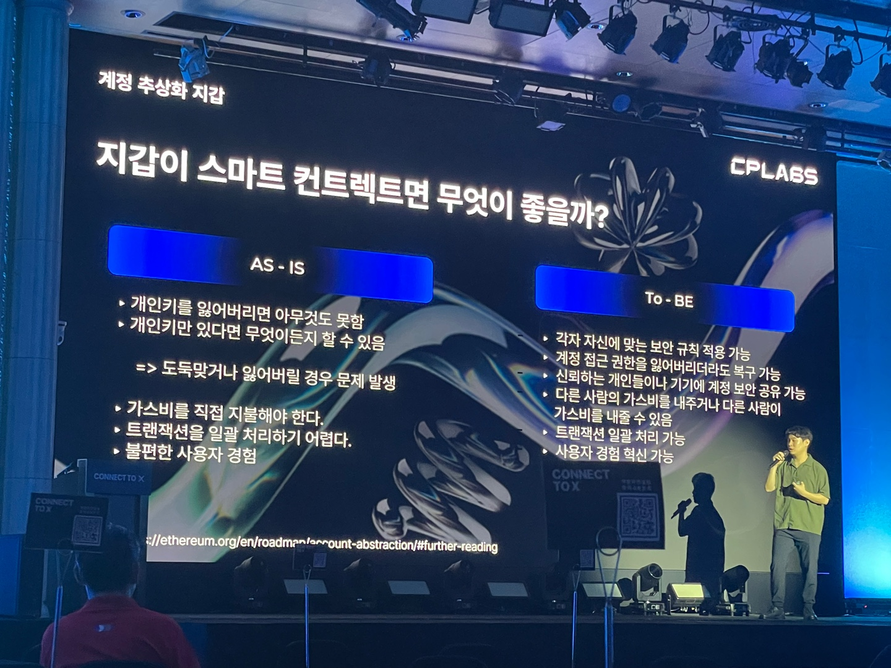
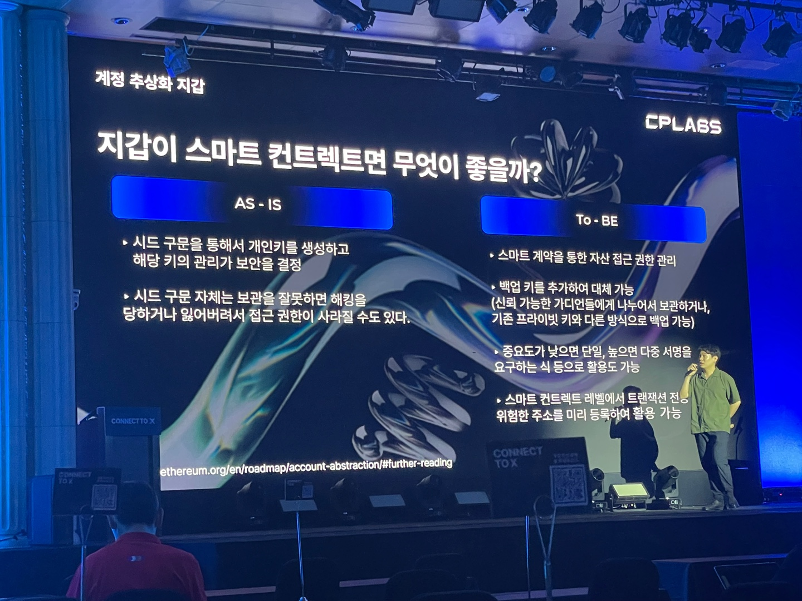
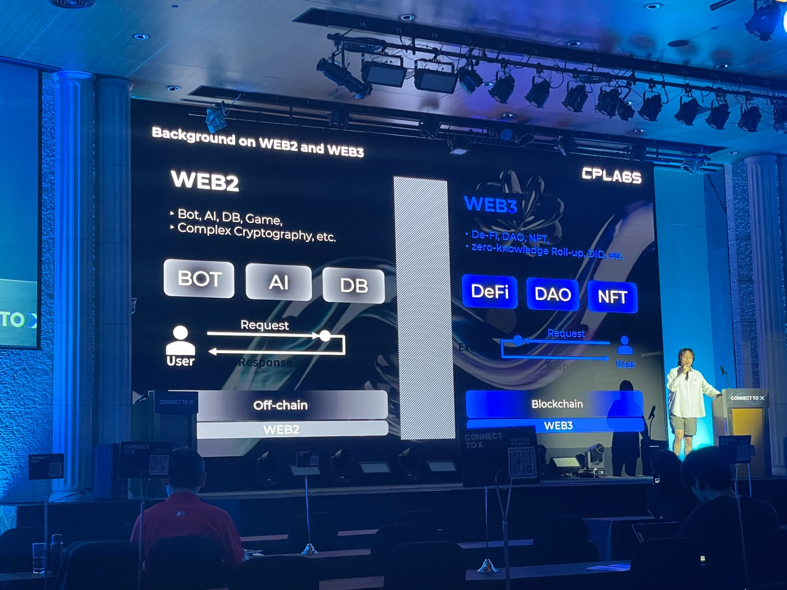
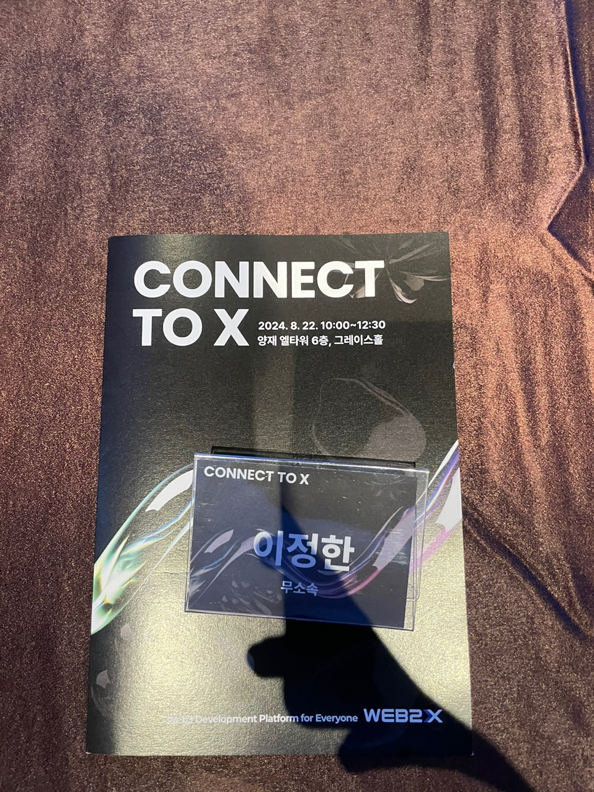

그렇다 오늘도 거의 1시40분 걸려서 왔다. 이제는 2시간 이내는 감사할 정도로 너무 오래걸리는곳이 많다 

문 열고 들어가려는데 진짜 문이 철문같아서 문여는데 힘들었다. 한 4-5 미터 문 ㄷㄷ

# web3와 전통금융과의 연결
- 기술의 발전이 되면서 사람들의 관심이나 인식이 해당 나라의 기술이 표준화 또는 일반화되는데 상관이 많음

# 웹2유저와 웹3 서비스의 연결

- 생태계는 점점 브릿지 등 기술을 사용해서 체인 추상화가 진행중
- 계정 추상화(AA; Account Abstraction): 목적 서명방식과 가스비 관리로 유저 유입을 편하게 하기 
- 계정 추상화는 예전부터 논의되이썼고 지금은 과도기 단계 (ERC-4337을 contract으로 구현해서 가장 많이 사용중)
- cross chain bridge: 다른 체인끼리 코인을 거래하는 기술 (원리: 중앙화 업체가 증표를 사용해서 옮기는것같은 효과)
- 그래서 브릿지 표준화가 uniswap과 다른 회사가 같이 진행됨 (ERC7683)

=> 체인 추상화, 계정 추상화, 브릿지 추상화 등 다양한 표준화의 큰 목적은 `유저 친화적`

# 웹2유저와 웹3 서비스의 연결
> AI와 블록체인 연결

- web3.0에는 블록체인과 AI가 같이 포함되어 있는 단어로 인식됨
- web2(BOT, AI, DB)요소를 web3요소(DeFi, DAO, NFT)에 합병하는 곳에 관심

**chainlink functions**  
> web3.0에서 web2.0의 기능을 사용하기 위해 사용자의 요청을 서버에서 처리하고 결과를 web3.0으로 응답하는 기술
- chainlink의 서버도 탈중앙화되어있음 (약간 오라클 네트워크 서비스)
- js 코드를 contract에 담아서 사용을 해야 하는 단점 (code size, excution time limit, 보안(API키 등), contract 강제상속)
- chainlink automation: 특정 조건이 충족되면 실행되는 기능 (time-based, log, custom)
- 아직 web2.0의 이벤트를 web3.0로 가져오는 기능은 없음

**cartesi**  
> 리눅스 VM(runtime)을 사용한 블록체인 (=EVM에 한정되지 않는 리눅스에서 사용가능한 모든 기능을 사용가능한 장점)
- rollup: layer 2같은 신뢰를 ETH에 위탁하고 실행만 하는 것

**ORA**  
> AI를 블록체인에서 사용할 수 있게하는 프로젝트
- OPML, ZKML

**WEB2X**  
> web2와 web3 사이의 이벤트 트리거로 서로 데이터 교환 가능 (CPLABS)
- contract(상속이 아닌 call로 연결), bot, virtual machine
- code를 서버에서 관리해서 unlimited
- 요청과 응답이 다른 블록체인끼리 사용될 수 있음 (crosschain messaging; 제3자 없이 증명이 불가능하다고 증명되어있음)
- 다양한 문제 해결: 보안(API키 문제 -> 하드웨어 암호화? (그런데 이것도 신뢰가 필요), 동형암호(암호화된 채로 인증이 가능한 비싼 방식))

이제 졸업해서 진정한 무소속~~백수~~가 되어버린 나