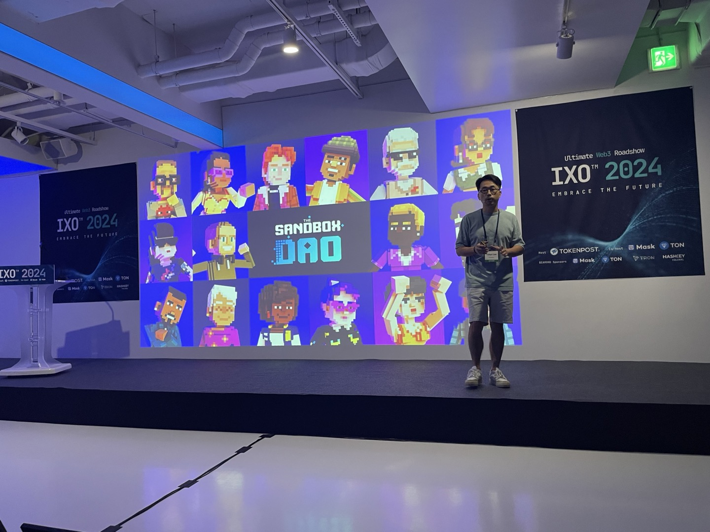

# IXO 1일차

> ## [IXO 2일차 보러가기](../2/2일차.md)

# 안랩

- Web3 보안 월렛 서비스(ABC wallet) & 플랫폼 
- Sk와 플랫폼 같이 개발중

# 맘모스 (MAMMOTH)

- 메인넷 개발중
- 서비스가 필요한것이 나오면 플랫폼이 만들어짐 (전구 -> 전력망 구축) (미시적인것이 거시적인것으로 확장되는것 같다)
- 거래소가 망하면 거래소 오프체인에서 코인을 가지고 있는 사용자들이 코인을 잃으면서 해당 코인 네트워크에도 타격을 입는것 같음
- DOSA survival 게임 있음

# The Sandbox

- 가상공간에 지역을 구입하고 랜드마크 짓는 가상환경 web3 게임
- 외국에서 개발된 게임
- 게임 내 정책 의사결정을 sand화폐로 투표 (항상 옳바른 결정을 할 수 없어 투표권이 크거나 개입이 있을 수 있음: 그런데 파괴적인 투표도 가끔 나올것같은 느낌)

# 거래와 트래블룰
> https://www.codevasp.com/

- 거래소끼리 데이터 전송과 암호화 표준을 구현해서 중간다리를 맡는 역할

# 웹3 콘텐츠 강화

- 넷마블 블록체인 게임 사업부

# 가상자산 범죄

- 스테이블코인은 패딩되있어 비교적 안정, 코인교환, 현금교환 의 장점으로 불법자산의 스테이블 코인 비율이 증가
- 테더도 불법자금으로 많이 쓰여서 체이널리시스와 협업

# web3 데이터 프로토콜

- perme: 데이터 주권을 자신에게
- 개인정보가 어디서 쓰이고 있는지 대시보드 제공

# 비트코인의 부 저장방법

- 비트세이빙: 비트코인 적립식(DCA) 투자 솔루션
- 전통화폐 단점: 인플레이션, 접근성, 지정학적 제약, 적은 흐름성
- 비트코인은 위 단점들을 해소

# 가상화폐 문해력의 투명성

- 레모네이드: 어학을 주제로 한 교육 관련 업체
- 역사적으로 화폐 변화시기에 사기가 항상 많았음 -> 조심
- 한국은 법이 늦게 따라가고 경제 관련 블록체인 교육이 잘 이루어지지 않음, 일본이랑 미국은 교육과 포럼이 활발히 이루어져서 사기 피해금액이 줄어들은 효과

# DID 서비스 띠딧

- 지정학적으로 독립적인 Id 시스템 사용가능
- 미국 국제 면허증 발급 테스트 중, 국내 시도중

# 리플 빅뱅 (문창훈)

- 리플 유튜버분
- 리플은 50개국(은행?)이 참여하고 있음 (BIS 58개)
- 리플은 전통금융과 긴밀하게 연결되어 있는 증거들(미국 정부, 각 나라 은행, 세계 금융 단체 등)
- BIS에 Ripple 결제방식 테스트 문서가 나옴
-

# 단어
- MASS adoption: 실제 사용자들에게 서비스가 사용되는 단계
- 트래블룰(travel rule): 자금세탁을 방지하기 위해 전송과 수신측이 사용자의 정보를 수집하고 확인하는 규칙
- 토크노믹스(tokenomics)
- fiat currency: 정부가 가치를 보증해 퍼뜨리는 화폐
- DID: Decentralized Identity

# 느낀점
- 발표를 할 때 서사가 중요한것 같다. 왜냐하면 청중 입장에서는 너무 많은 발표가 있어서 제품의 기술력보다는 먼저 ”문제점“을 왜 문제가 있는지 설명하고, 이것을 우리의 프로젝트가 “어떻게 해결할 수 있다는 것”을 잘 알려주는것이 가장 기억에 남는 방법이었다.
