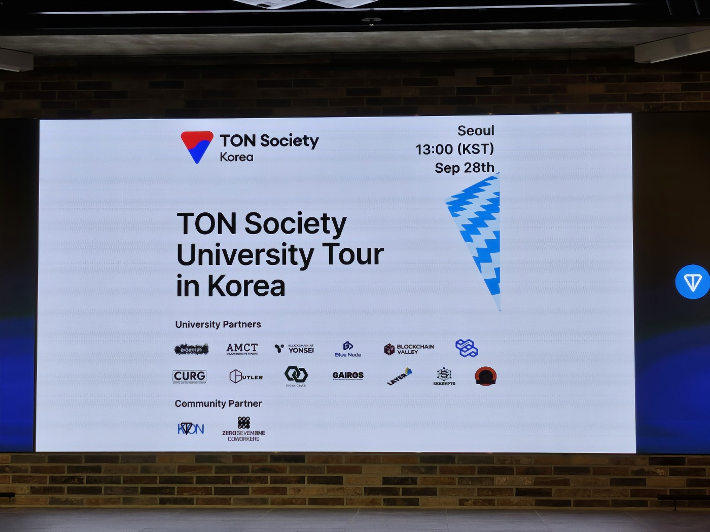
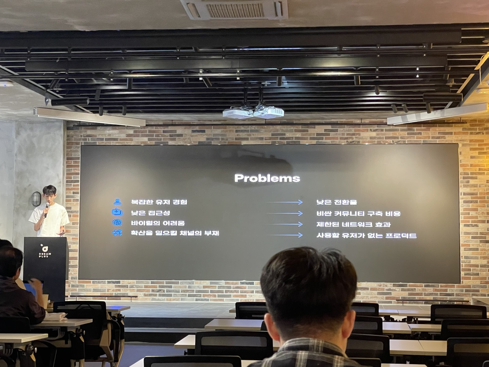
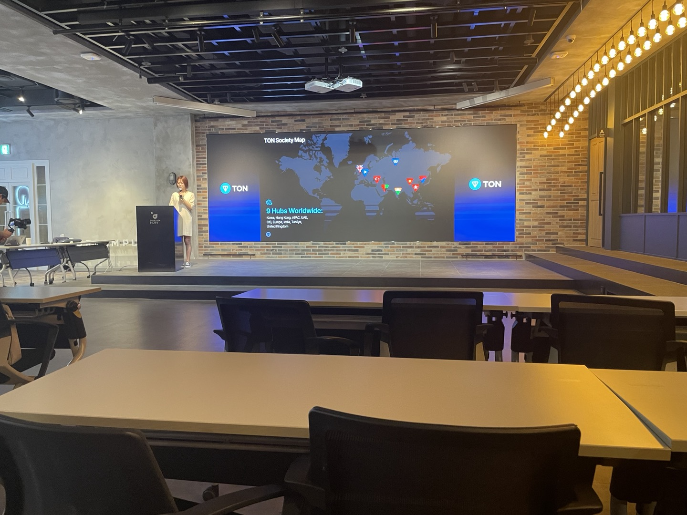
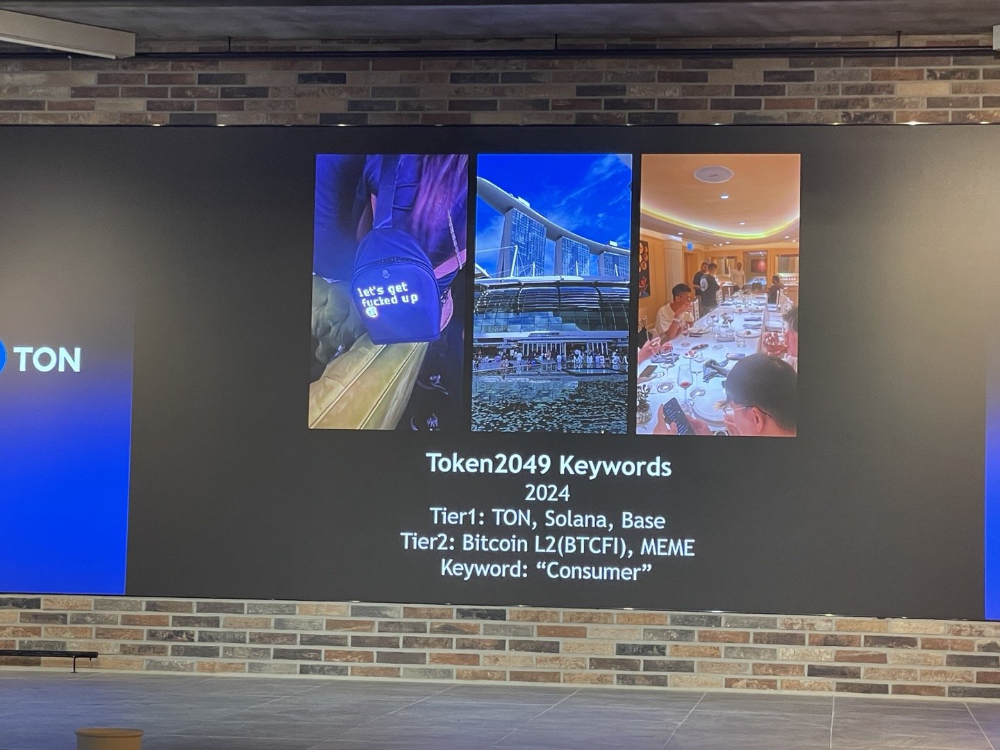
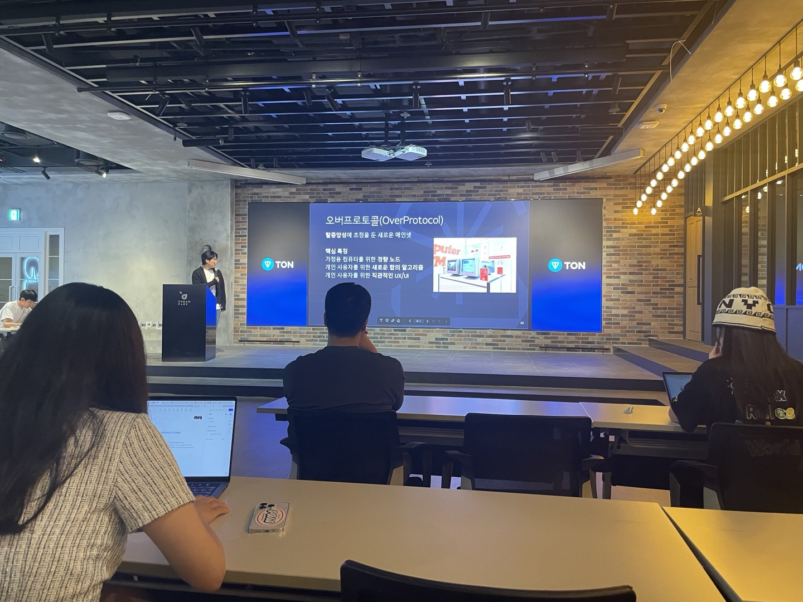
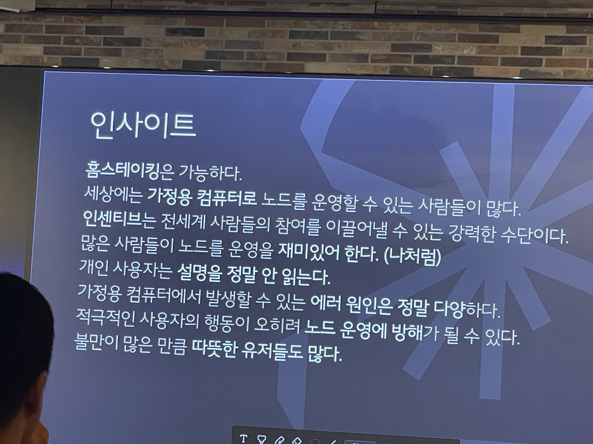
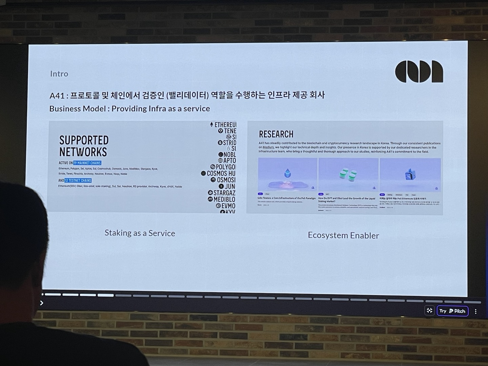
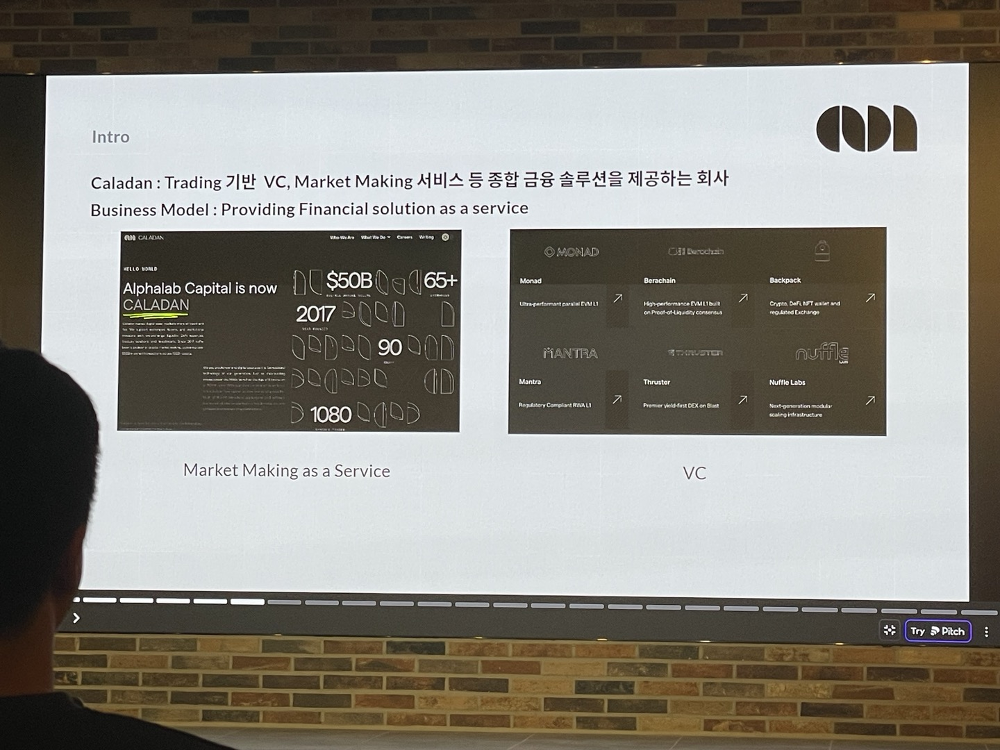
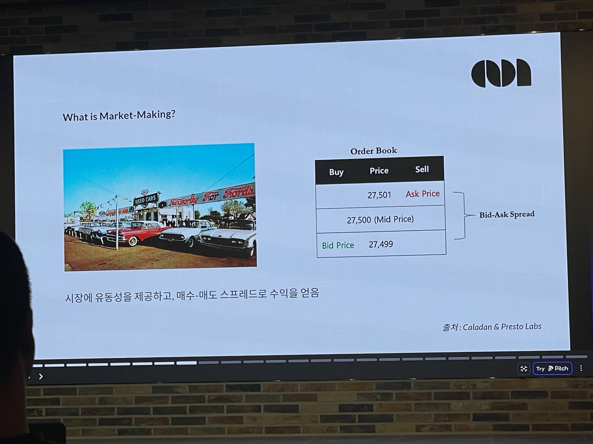

# TON Society University Tour in Korea
> https://lu.ma/rjl22nxm?tk=KGbT1i

**Problem과 해결점 사진**  
텔레그램 미니앱이 web3에 접근성을 확실히 높여주는것 같다. 앱 안에서 지갑도 연동이 바로 되서 결제가 편리하고, 웹 자체를 지원해서 web3안에서 자유롭게 만들고 시도해볼 수 있는거같다. 지금은 GameFi가 많고 사람도 되게 많이 몰려있지만 지금 느낌은 아직 순수 게임재미보다는 돈을 위해서 게임을 하는 느낌이 조금 들었다.

나중에 TON(The Open Network)이 게임에서 끝나지 않고, 텔레그램의 장점인 개인정보보호 초점을 맞춘 서비스들이 나와서 사용되면 좋을것 같았다.

**텔레그램 게임을 만들 때 고려하면 좋은 것들**  
- 나이, 지역, 습관
- 게임이론 (본능..)
- 레퍼럴 시스템 (앱 실행뒤에 인자 붙여서)
- 경쟁자와 리더보드(너무 많은것보다 작은 그룹에 효과가 좋음, retention 유지에 좋음)
- 팀 게임
- PvP (실시간 또는 비실시간)
- KOL(Key Opinion Leader): 유명 인플루언서 협력 (보상 있어야 함)
- 봇 채널 메세지
- 리텐션과 전환율 (봇 채널 메세지, 매일 보상)
- 밸런스 중요

**TMA 간단히 만들기**  
- grammY.js이랑 python telegram bot(가장 많이 사용됨)
- tgui = ui 

grammY.js를 써봤는데 다른 js 라이브러리보다 덜 알려졌는데 docs가 매우 잘되어 있어서 정말 쓰기 편했다.

## TON society

- 여러나라 톤 생태계 사회
- 매달 오프라인 모임, 아이어톤, 매년 부트캠프(6월), 해커톤 
- 서포트 사이트: https://eco.ton.org/en (아이디어, 빌더)
- https://ton-org.notion.site/Welcome-to-TON-founder-ca6c2e3607fe4170a9fe984397e7bf5c
- https://society.ton.org/about

## Token2049 quick takeaway
> 싱가폴 token2049 경험담

- 금융, 크립토의 허브
- 이번 키워드: TON, Solana, Base, Bitcoin L2(BTCFI), MEME
- KTON 

## “Decipher"ing the Past: My Blockchain Journey (과거 블록체인 이야기)

- 블록체인 공부 학회 모임 "디사이퍼" (인터넷에서 블록체인 공부할 때 많이 읽었던 블로그 글을 여기서 보았다)
- 블록체인은 “거래” 를 위한 플랫폼이라고 생각하셨다 (나라가 금융이 아닌, IT가 금융을 하는 P2P)
- 오버프로토콜 제작중..

## 비니지스 디벨롭먼트 (BD)

- A41에서 일하시다가 Caladan으로 이직하는 이사도중(?) 오신 분
- Market Making: 시장 유동성 제공하면서 매수 매도 차익에서 이득도 얻음
- 철학+기술+금융이 합쳐져있어서 매력적이라고 하심
- 영어 + 사람들과 말하기를 엄청 연습하셨다고 한다. 완전 E로 보이시는데 ㄷㄷ
- Web3로 다양한 경험을 할수있는 공간이라고 생각하심
- 두려움 -> 정의하고 해결책세우고 실행하기

유니스왑의 AMM처럼 블록체인 생태계는 수요와 공급에 기반한 사람의 심리/사회적인 행동을 기반으로 한 제품이 동작되는곳 같다. => 그래서 꼭 마켓뿐만 아니라 다른 제품을 만들 때 사용해볼 수 있는 방식 같아서 재밌다.

## 배운 단어
- MAW(Monthly Active Wallet): 월 활성 사용자 수
- TVL(Total Value Locked): 총 예치된 금액의 합
- FOMO(Fear Of Missing Out): 놓치는 것에 대한 두려움을 의미하는 심리적 현상
- stone.fi: staking과 liquidity mining 하는 DeFi 플랫폼