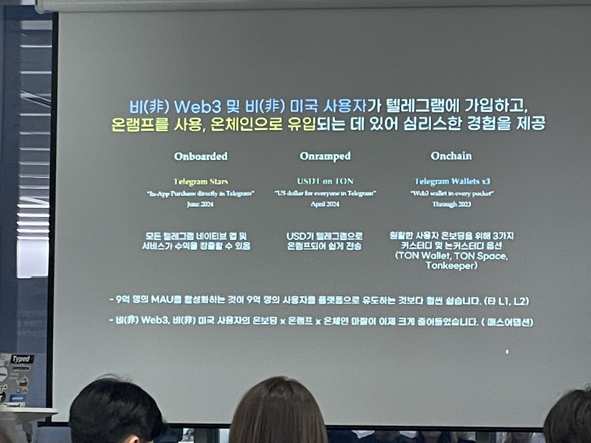
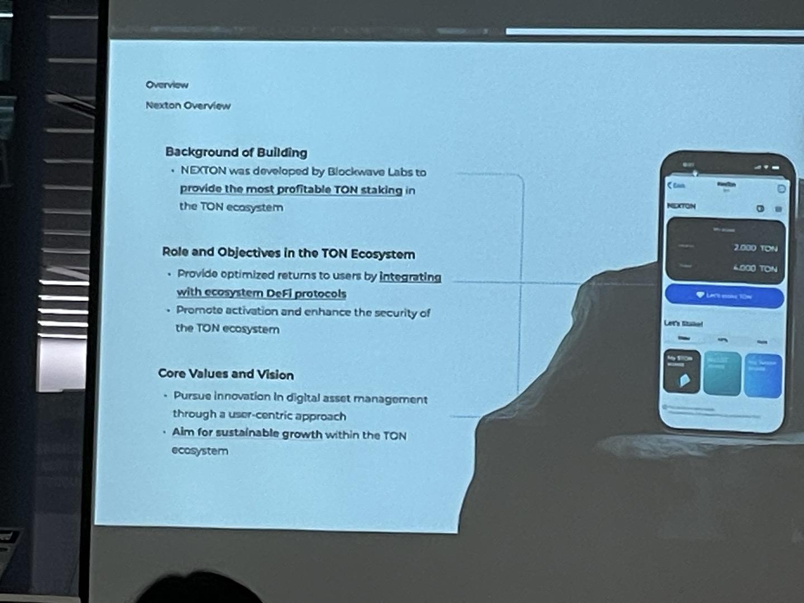

# TON Builder's Day
> TON 소개: 빌더와 함께
- telegram 유일 파트너
- 유저 사용자수가 많은것이 장점
- Telegram: distribution, Ton:ownership, wallet: network?
- Telegram miniapp 플랫폼과 성장가능성

**TWA 만들 때**  
> 목표: 전환율conversion과 리텐션retention
- 사용자(누군가, 나이, 성별 등)
- 해야하는 당위성 (게임이론), 인간의 본능
- 레퍼럴 & 초대 시스템 (보상 필요!)
- 리더보드 (경쟁심 자극)
- 스쿼드 시스템
- KOL 중요
- Wallet pay 연동하면 편함
- Miniapp이 아닌 bot chat을 이용한 상호작용도 중요
- 랜덤성은 좋지만 밸런스를 무너뜨리면 안됨 

# KTON

- 텔레그램 유저 데이터도 사용해서 인터렉션이 좋아진다
- 봇과 상호작용도 활용
- 업데이트가 필요없은 on-live 상태

**KTON 소개**  

- TWA의 커버리지는 글로벌...

# NNN
> 게임 관련

- 게임성도 중요

# Salt
> DEX 트레이딩 봇 관련(유저가 만드는)

- 요즘은 멤코인과 CEX의 통제 그리고 유동성 창고 역할을 벗어나겠다 등의 이유로 CEX에서 DEX로 많이 넘어가는중
- 계정 추상화 screening contract 사용
- DEX의 swap만이 아닌 여러 방식의 거래방식 지원중
- TWA 에서도 봇 런칭함

# Vassblock

- 암호화폐 시장 인식이 안좋아서 사업이 힘든것이다..
- Web3 standard 만드는것이 목표 (배지?)
- 회사를 다방면으로 평가해서 인증서 같은것을 주는 것
- 거래소, 체인, 온체인, 오프체인 등 다양한 분야에 활동

# TappingCat
> 방치형 RPG Dapp

- TON이 성장 가능성 높은 생태계로 미니게임 출시 목표
- 예시 게임: 온뮤즈

# myClub

- 오프체인 텔레그램과 온체인 TON사이의 고객 관리 서비스 제공
- 고객 관리를 UI로 편하게 제공

# XNP
> 젖꼭ㅈ…읍. 밈 프로젝트

- IOT와 Web2 관련 하시는 분
- 가장~~강제~~ 기억에 남아버렸다

# Nexton-marathon

- 스테이킹(liquid staking) 차익거래? 서비스
- 밈코인을 블록체인 생태계를 꼭 망가뜨리는 역할이라고 하기 보단 카지노와 같이 게임과 같이 생각하고 가볍게 즐기는 서비스로 볼 수도 있다고 하셨다
- TON코인을 defi 의 gateway로서 사용하려 함
- arbitrage bot 수익률이 80%로 나오는중이지만 지속이 확실하지 않음

# 기타
- Notcoin과 밈코인
- 행사: ABS(A blockchain summer), Token 2024

# 링크
- lu.ma 이벤트 페이지: https://lu.ma/1yq2d2g1?tk=TTB3zv

