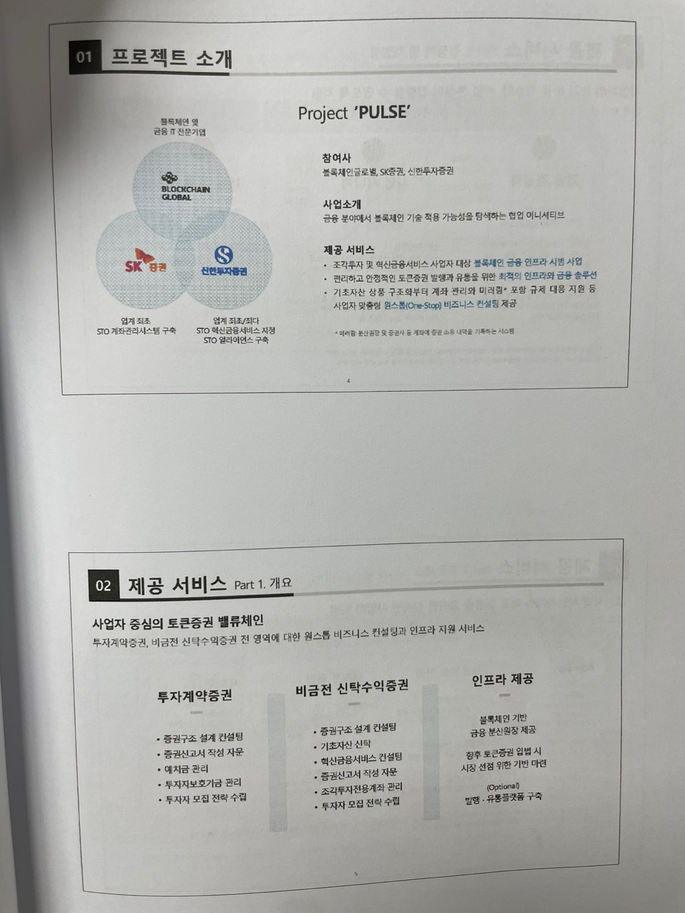

친구랑 이번주도 블록체인 세미나를 갔다. 제목 "블록체인 기반 글로벌 토큰증권 (STO) 지방세원 다양화 방안"

2시시작을 1시시작으로 잘못알아서 12시 10분쯤 도착해서 동국대 입구도 못찾아 헤매며 뒷 원룸촌산 오르며 땀을 흘리다 배고파져서 동국대 학식을 먹으러 갔다. 먼저 5~6천원대 가격에 놀랐고, 메뉴가 맛잇는거만 있어서 놀랐고, 맛이 실제로 있어서 놀랐다.

밥먹고 친구랑 만나고 1시 50분쯤 들어가서 자리에 앉는다. 앞 40분은 축사여서 요약해서 오늘 어떤 이야기가 나올것을 말해주셨다.

그리고 시작!

# 수호아이오

- 스테이블코인은 가상자산과 현실자산을 이어주는 역할
- USDT는 미국 달러 가치에 페깅된 코인이므로 미국이 선호 (달러 가치 방어)
- 블록체인 파편화로 자산 이동 문제 -> SWIFT, chain link, FED, jpmorgan등이 컨소시엄 만들어서 이체 테스트중
- 금융 발전단계(기술->디바이스->상품->제도): 채권, 주식, 증권, 증권화(세계화로 증권 발전), 금융상품 파생, 디지털 자산화(RWA)

# 신한투자증권

- 아직 인프라 관련 법 제정이 2년정도 남았다고 예측, 상품은 많이 개발중이지만 법이 아직 못 따라옴
- 상품에 블록체인 기술 자체가 있는지 없는지 유무보다는 사용자들의 니즈가 가장 중요
- 미래 금융위에서 인프라 가이드라인중 확실한것은 ”다중 참여 노드“ 가 중요하다고 함
- 증권화 과정에 은행들이 진행중

# KODA

<!-- - 국민은행 전 직장인 분 -->
- RWA를 생각하며 STO를 생각
- 실제 가격변동성이 조금 있고 매수 매도 거래가 일어나는 자산을 토큰화해야 의미있다고 생각 (아파트나 가격이 잘 안변하고 그런 상품은 토큰화 오히려 번거로움)
- STO 시장을 자유시장으로 맡기는것이 좋아보인다고 하심

# 지방세원
- 일본은 금융권 낙후됬음에도 STO를 회사 주식 발행, 탄소배출권 등으로 적용중
- 이 떄 사실 학식 또 너무 먹고 싶은 충동이 들어서 못참고 친구랑 나가서 학식 한번 더 먹고 와서 못들었다..

# 우리들 녹지금융 

> 헬스케어 금융
- STO도 국내 법에만 한정지으며 생각하지 말고 외국에게 투자 받기,하기 를 할 수 있게 국제 법에 따라야 함
- 전범국 일본은 금융회사가 자국에 못들어오게 함 (그래서 라인을 한국이 키우게 하고 가져옴->일본이 라인으로 헬스케어 산업 키우려고 함 -> 근거 더 필요), 일본은 대부업이 많이 발전
- STO에 맞는 비니지스 모델들이 있다
- STO에서는 커뮤니티가 중요 -> DAOs

# 동남아시아 RWA 시장

- 서울랩스(기술회사), 동남아시아 대만 시장 등
- 스타트업에게 STO 관련 법이 너무 강한 한국보다 널널한(gray zone) 동남아시아에 진출함
- 탄소배출권이 남아 부족한 나라에게 판매할 플랫폼 제공 시도

토론  
- 우리나라 STO는 거의 다 증권으로 봄 (해외와 한국이 취급하는 자산의 범주가 다름)
- 스타트업(아이피샵) 스타트업 금융 규제 받아서 사업이 롤러코스터 타시다가 해외시장으로 가심 (금융감독원에서 한국이 아닌 법이 모호한?/확실한? 외국으로 사업을 추천하셨다고 함)

## 단어
- RWA: Real World Asset (예술품,상품,채권,부동산)
- STO: Security Token Offering
- chainlink: 오라클 네트워크를 진행하는 회사이자 기술
- 1, 2, 3형 통화: 은행의 자본을 신뢰도에 따라 핵심 자본(Tier 1), 보조 자본(Tier 2), 추가 자본(Tier 3)
- BaaS (Banking as a Service): 비은행 기업이 API를 통해 은행의 금융 서비스를 통합 및 제공할 수 있게 하는 플랫폼
- 기초자산: 파생상품의 가치를 결정하는 기본 자산 (주식, 원유 등등)

# 느낀점
- 발표가 너무 빨랐다
- 마이크 소리가 잘 안들렸다 웅웅
- 학식 너무 맛있다 2번먹음
- 세미나/포럼들을 다니며 느낀것중 재밋는것은 각 전문가분들의 블록체인 공통분야는 같아도 조금씩 다른 전문성이 큰 관점 차이를 만들어낸다는것이 듣는 청중입장에서 다양하게 들을수있어 신기했다
- 외국에선 벌써 많은 CBDC가 점점 진행되는 느낌이 든다
- 마지막 만찬으로 졸졸 따라가서 먹은 장충동 족발 미쳣다 원래 감사히 잘먹었습니다 라고 말하고 싶었는데 부끄러워서 친구랑 같이 나와버렸다. 다음부턴 인사 꼭 하고 나올것이다.
- [다시보기 링크](https://www.youtube.com/watch?v=hBDIgoT0V38&pp=ygUm7KeA67Cp7IS47JuQIOu4lOuhnOqyjOyduCDthqDtgbDspp3qtow%3D)

 ~~디양화~~?

끝나고 충무로~광화문? 걷다가 궁 안에 들어가서 있따가 집으로 복귀