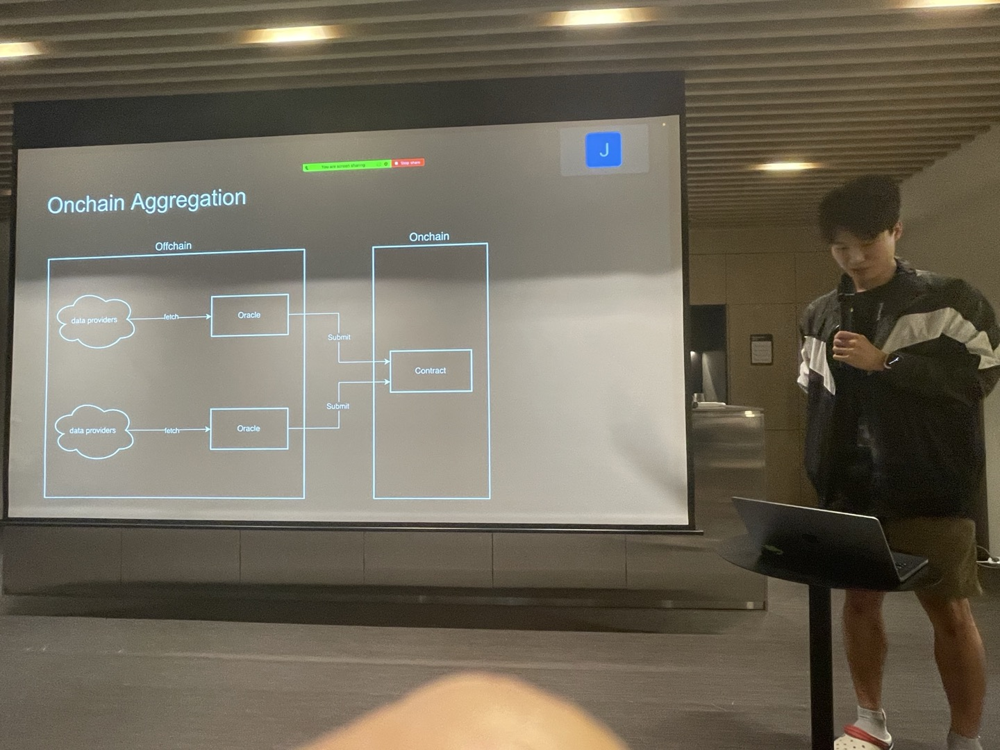
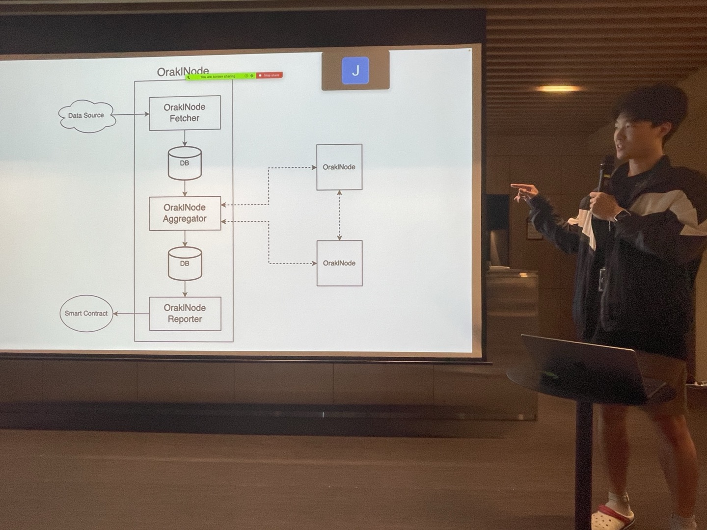
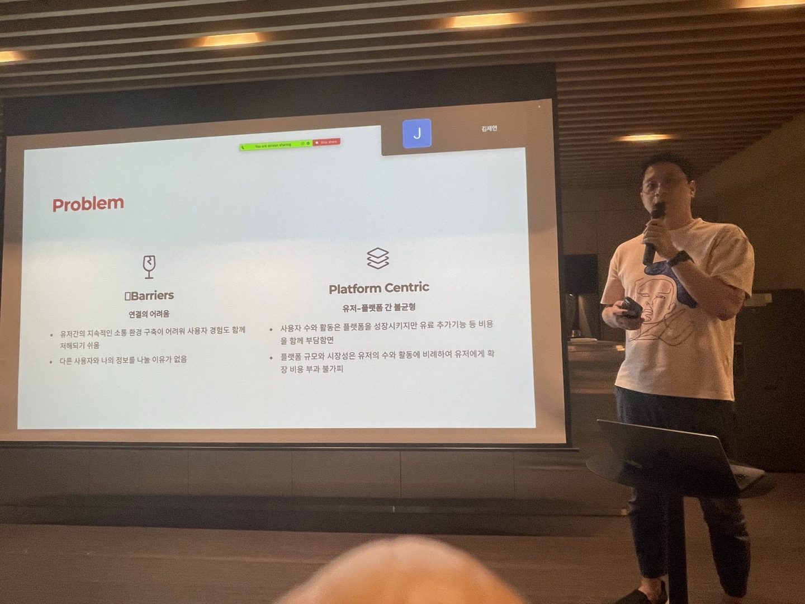
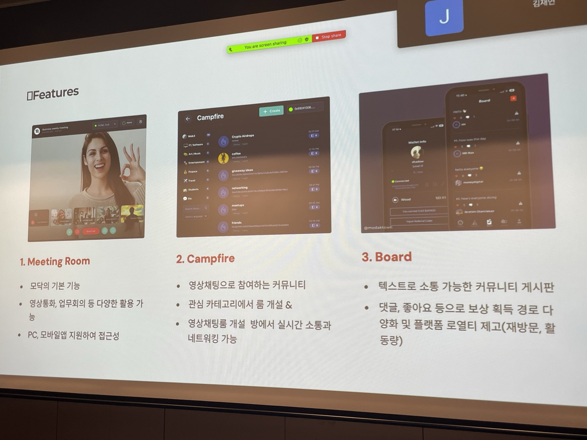

친구들과 함께 디스코드랑 유튜브에서 알게된 오늘 강남에서 열리는 한국 블록체인 밋업 20회에 처음으로 가보았다. 사실 시간표에 저녁이 있어서 조금의 흑심?을 품고 갔다.

그래도 관심있는 분야는 밥을 안주어도 갈만큼 재미있어서 사실 저녁 없어도 갈것이었다.

그리고 2개의 세션이 있었는데 이번에는 약 40분정도로 빨리 끝났다.고 하셨다.

세션 정리!

## BISONAI

> BISONAI는 자체적으로 오라클 네트워크인 Orakl Network를 운영, 이 네트워크는 Klaytn 블록체인 생태계를 지원하기 위해 설계된 분산형 오라클 네트워크로, 데이터 피드, 검증 가능한 랜덤 함수(VRF), 요청-응답(Request-Response), 그리고 예비금 증명(Proof of Reserve) 등의 서비스를 제공 (by GPT)

오라클 블록체인 네트워크를 발표하신 분 orakl~~aytn?~~

> [!NOTE]  
> 오라클: 외부 데이터를 블록체인 안으로 가져오는 시스템 (신뢰할 수 없기 때문에 여러 노드가 제출한 값의 중앙값, 평균값, 다수결 등의 다양한 방법 존재)

먼저 든 생각은 오라클 네트워크 자체를 서비스화 하는것이 꽤 매력적으로 보였다. 왜냐하면 블록체인 생태계에서 외부 데이터에 대한 접근은 지속적으로 필요할것이고, 또한 사용자도 오라클 네트워크에 노드로써 들어와서 또는 신뢰할 수 있는 노드에게 물어봐서 비용을 지불하게 되서 또 하나의 생태계가 만들어지는것 같다.

BISONAI의 이번 발표는 업그레이드가 주요 주제였다.
- 외부 데이터 업데이터 시간 15s -> 2s
- 기술 스택 변경: Raft consensus, LibP2P, BootAPI, Foundry
- push패턴() > pull패턴
등..

질문 이 있엇는데 처음가서 타이밍을 놓쳐서 못했다.. 다음에 물어보고 싶다.
- API 값 최소시간만큼 블록채굴 시간이 필요한가요?

---

## Modak

> WebRTC API를 이용한 비디오 커뮤니케이션 모임 서비스

오늘 같은 대면행사 또는 비대면까지 포함해서 모임을 주선하고 관리해주는 플랫폼

**특징**  
- 토큰 생태계 (입장료/질 좋은 정보 제공으로 토큰을 얻고, 입장료로 사용 가능)
- 대학과 연계하여 서비스 제공중 (이런전략이 매우 중요하다고 생각함 -> 왜냐하면 먼저 학생들이 어릴 때 익숙한 도구를 커서 실제 회사에서 사용하게 될 확률이 높고 -> 자연스레 점유율 유지로 사용자를 계속 확보할 수 있는것 같다)
- Modak 뜻: 모닥불, 토큰이름: WOOD (모닥불의 연료) 이러한 비유 이름이 갠적으로 너무 맘에 들었다.

**질문**  
- P2P를 영상 연결 서비스에 사용하면 비용절감이 되지 않나요?: 1대1이면 가능하지만, 보통 다수와 다수가 연결하기 때문에 개인 컴퓨터 리소스가 버티질 못해서 중개서버 필요

# 개인적인 질문들
- CBDC 22년 klaytn: 조금 안좋게 끝남(네이버 클라우드 bandwidth가 안좋아서, 그래서 AWS를 생각했다고 하심) (테스트도 klaytn으로 하심)

끝나고 친구들과 블록체인과 백수탈출 이야기하면서 1~2시간 산책하고 집으로 갔다

친구들이랑 같이 들으면 공부하면서 여행하는 느낌이어서 재밌다