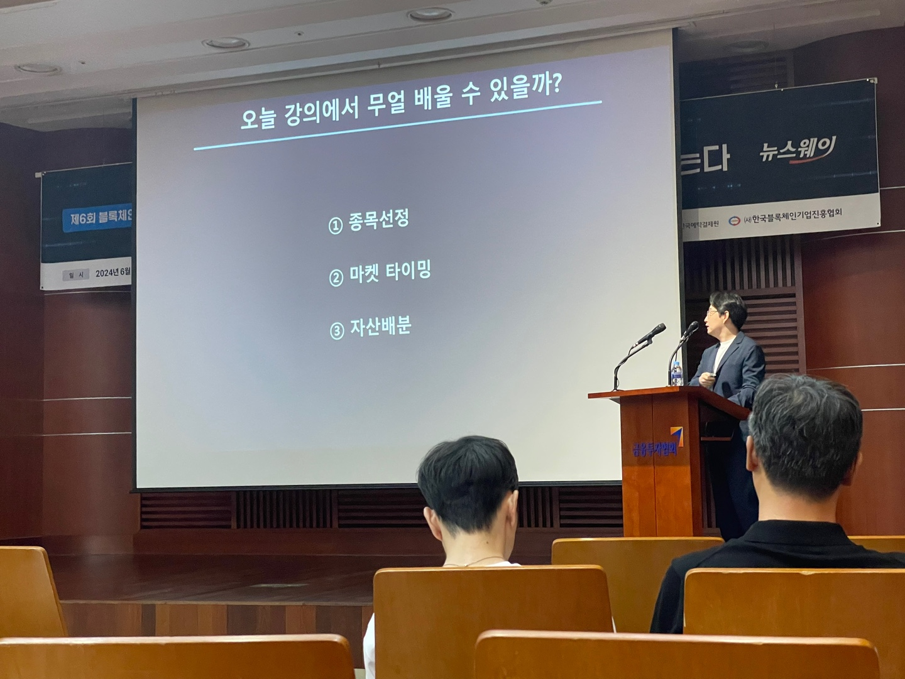

# 시작
오늘도 어김없이 2시간 정도 걸려서 서울을 왔다. 사당역 찹쌀치즈빵 사먹었다가 맛있어서 집갈때 또 먹었다. 또 생각난다 츄릅p

연령대가 다양하다. 학생~아주머니 할아버지. 금융쪽이라서 그런것같다.

오늘도 친구와 같이 들었다. 국밥처럼 든든한 친구다 근데 좀 늦게왔다

처음 발표를 하시는 오태민 교수님은 우연찮게? 유튜브에서 비트코인 관련 영상 2편 시리즈를 보고 설마 했는데 유튜브에서 본 교수님이 나와서 놀랐다. 그것도 1~2주 전에 본 것이었다.

# 오태민 교수님
(사진을 못찍었다)

> 건국대 정보통신대학원 블록체인학과 교수님
- 블록체인은 생태계 동작 비용을 어떻게 잘 만들지가 중요
- 경제학 예측은 거의 기상학 예측일 정도로 사실 엄청 불확실성이 크다 (농담으로 현상 분석 학과)
- 비트코인은 거시경제 영향에 덜 맞는다 금처럼
- 비트코인은 아직도 망한다 라는 사람이 많다 = 그분들이 인정할 가격까지 올라갈 여력이 있다
- 돈 많은 사람들이 돈 움직일 때 유용함
- 전쟁같은 상황일 때도 유용
- 비트코인은 돈많은 사람들이 위기시 이용하는 장치가 되버릴수도 있음
- 비트코인은 금융역사에서 신용 전달을 국경없이 전달하는 발명품
- 변재의 최종성
- 트럼프 loves BTC + 뒷 코인관계자 + 반감기 = 가격 상승
- 주식의 차트는 쇼트쟁이들의 피 위에서 쓰여짐
- 보통 금융사는 왕국보다 오래감

단어
- 비상관자산
- 샤프지수

# 이용재
> 미래에셋증권 디지털자산TF 매니저
 

- ETF도 나오기 쉽지 않았던 vehicle(상품구조)
- 비트코인이 etf와 연동되면 자산이 더 몰림
- ETF가 뚫리면서 기관 투자가 시작되면서 지금 유입이 시작될 수 있음(기관들은 결제 기간이 걸리므로, 그리고 기관은 금방 팔지 않으므로 유지됨)
- ETF와 기초자산은 보통 동반성장
- 금융권 회사들이 비트코인 관련 시장을 육성하려함 (자산운용사들은 금융상품을 만드는걸 좋아함, 신대륙)
- ETF는 국가, 금융기관, 가상자산사업자(거래소), 투자자(옵션, 전략등 엮어서 만들 수 있어서) 모두에게 이득 (왜냐하면 새로운 가상자산 투자는 법이 아직 제정되지 않고 복잡하므로, 기존의 주식ETF를 활용하면 그대로 사용가능)
- 한국에서도 ETF상품 만들어서 시장이 생기게 될 것 같음

# 박종한
> 미디어워크 대표님

- 이번 발표는 순도 99% 투자에 관련되어 있어서 메모가 적어졌다.하지만 옆 아주머니와 아저씨들은 너무(?) 좋아하셨다
- 내러티브: 정성적
- 펀더멘탈: 정량적
- 새로운 상승장은 신규코인이 기회비용이 커서 추천
- 섹터(AI, 게임 등)별로 자본이 움직임

# 느낀점
- 관점 다양 너무 다양
- 신뢰의 혁신으로 만들어진 비트코인이 계속 남을 큰 이유라고 생각하신 오태민 교수님의 생각 인정
- 하지만 2번째분인, 금융업계의 무한 상품 생성으로 수익을 벌 수 있기 떄문에도 코인이 계속 갈것이라는 것도 새로운 관점이여서 신기했다.

# 마무리
끝나고 친구가 소개해준 국밥집가서 순대국밥이라는 이름의 가명을 뒤집어쓴 내장탕을 먹고 그런데 맛있어 또 재밋는 산책하다가~ 집 귀국

