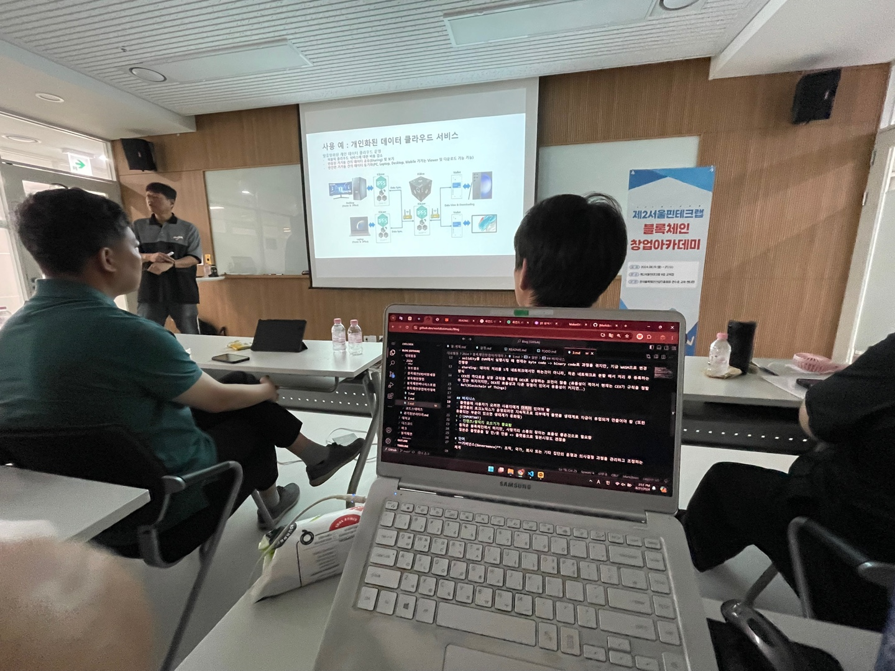

# 블록체인 창업 아카데미
창업은 아니지만 블록체인 공부하러온 나

먼저 제2서울핀테크랩에 감동 먹었다. 간식이랑 빵이랑 서브웨이 샌드위치를 먹을 수 있어서 2시간이 걸려도 다음날을 설레면서 왔다.

이번 강의는 짧아서 아쉬웠지만 짧은대로 3일동안 재밌게 들었다. 중간 실습이 있는것도 좋았고 무엇보다 블록체인은 뭔가 배워도 새로운 개념이 스스로 탄생하는 느낌(?) 이 있어서 새로운것들을 배울것이 생겨나서 좋은것같다. 그리고 기술 이야기 말고 중간 어른분들이 이야기하는 세상 이야기도 좋았다. 갑자기 할머니 보고싶네. 세상이야기랑 옛날이야기는 재밋다.

복잡한 개념을 쉽게 하는게 어려운데, 강사님이 쉽게 설명하는 방식을 보면서 생각해보면서 들어봤다. 그리고 블록체인을 너무 이상적으로만 이야기 안해주시는것이 좋았다.

샌드위치와 과자와 매일 끝나고 친구랑 동생이랑 산책하면서 좋은 기억으로 남았닷!

# 정리한 것
두서없이 적어놓아서 정리중
- [1일차](1.md)
- [2일차](2.md)
- [3일차](3.md)