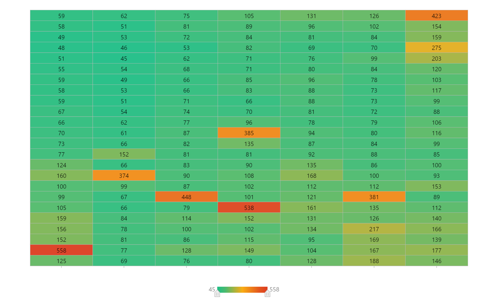
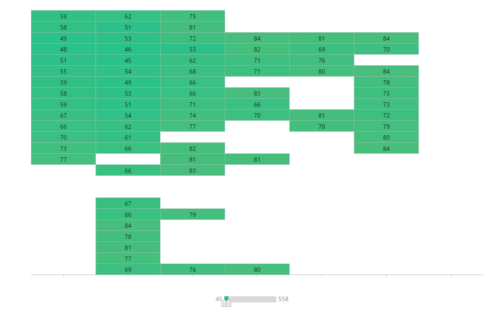

# 설명
- NFT 관련 문서

# 알아볼 것
- NFT 스마트콘트랙트 작성법 알아보기 (e.g. 재판매 수익 로열티)
- [OpenSea NTF 등록방법](https://steemit.com/coinkorea/@nightcoffee/metamask)
- [OpenSea NTF 등록방법](https://kingbit.tistory.com/2)
- [Binance 가입방법](https://tradingwong.tistory.com/22)
 
# 정보
- NFT관련 글들: https://brunch.co.kr/@sehi0315#articles
- [유튜브: 코인리서치](https://www.youtube.com/watch?v=4UUPeIz5804)
- [blog](https://jizard.tistory.com/268)
- (암호화폐 관련 많은 정보)(https://coinpick.com/)

# upbit
- [계좌 개설 방법](https://oppapost.com/203)
- [ethereum 출금 수수료 절약 방법](https://evrdh.tistory.com/entry/%EC%9D%B4%EB%8D%94%EB%A6%AC%EC%9B%80ETH-%EC%B6%9C%EA%B8%88-%EC%88%98%EC%88%98%EB%A3%8C-%EC%A0%88%EC%95%BD%ED%95%98%EA%B8%B0-feat-FTX-%EA%B1%B0%EB%9E%98%EC%86%8C)

# crypto game
- 크립토키티: http://wiki.hash.kr/index.php/%ED%81%AC%EB%A6%BD%ED%86%A0%ED%82%A4%ED%8B%B0#_
- 크립토키티: https://www.coindeskkorea.com/news/articleView.html?idxno=72672
- 크립토펑크 : https://learn.bybit.com/ko/crypto-kr/what-are-cryptopunks/

# NFT 거래 방법
- opensea 사이트에서 창작자로 등록하기 위해선 이더리움을 지불해야 함 > 이더리움 앱 METAMASK 지갑을 만들어야 함 > METAMASK에 원화(법정화폐)를 바로 입금하기 어렵기 때문에, 국내 암호화폐 거래소 계좌에서 METAMASK로 전송해야 함 > 국내 거래소 upbit 가입, upbit와 연동된 K뱅크 가입 > 

# ethereum gas fee
- [opensea gas fee 정책](https://support.opensea.io/hc/en-us/articles/1500006315941-What-are-gas-fees-on-OpenSea-)
- [gasnow(gas실시간, 통계)](https://www.gasnow.org/)
- [gas fee 여유시간 분석(정확x)](https://paxful.com/blog/ethereum-gas-price-explained/)

# 가스 시간 통계
- 2021/9월 1주 기준

# [Pealy Date](Pearly-Date.md)
- 날짜 NFT 프로젝트
