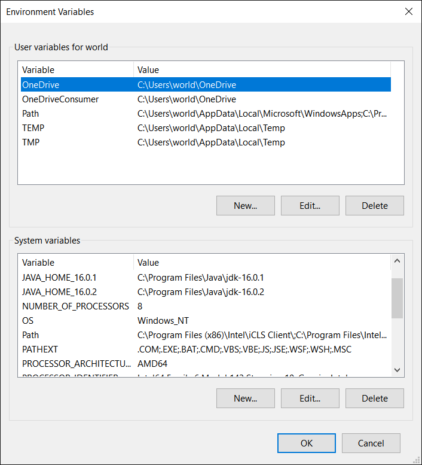

# 설명
- 자바의 환경 변수 설정 관련 정보

# 환경변수
- 컴퓨터 내의 어느 공간에서든 특정 프로그램을 실행시킬 수 있게 도와주는 변수 (원래 프로그램 실행시키려면, 프로그램 파일이 있는 디렉토리로 들어가야 함)
- e.g. `cmd` 창에서 `notepad` 를 입력하면 메모장 프로그램이 실행됨
- `시스템 변수`: 컴퓨터 내의 모든 곳에 적용되는 변수
- `사용자 변수`: 사용자 계정에서 적용되는 변수

# 환경변수 등록방법

1. 윈도우 검색창에 `환경` or `environment` 검색 후 들어가기
2. `환경 변수` 클릭
3. 밑의 System variables에서 JDK가 설치된 경로를 `JAVA_HOME` 이름으로 새로 만들기
4. `Path` 수정 들어가서 `%JAVA_HOME%\bin` 추가
5. 저장

# 주의사항
- JDK를 다운받으면 JDK경로로 바로가기가 설정된 `C://Program Files/Common Files/Oracle/java/javapath`경로가 환경변수에 자동으로 등록이 됨
- 이것은 새로운 JDK를 다운받으면 최신것으로 계속 업데이트되는것으로 추정됨
- JDK를 고정으로 사용하려면 이 경로를 지우고 `사용자 변수`로 등록해서 사용하는것이 편함 (저 경로를 지우고 `시스템 변수`로 등록하면 컴퓨터가 켜질 때 마다 환경변수가 인식이 안됨)
