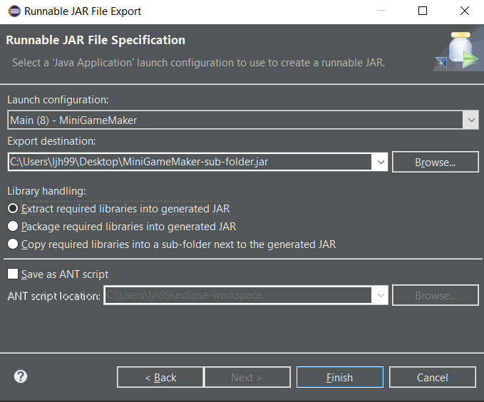

# 설명
- 이클립에서 Runnable Jar 파일로 추출하는 방법과 기타 설정값들에 대한 설명
- 라이브러리는 프로젝트에서 `Referenced Libaraies`와 `Maven Dependencies`의 라이브러리들을 모두 포함해서 적용됨
- JVM의 동작방식에 대해 이해가 필요함
- 반드시 `main` 메소드가 필요함 (굳이 실행되지 않을 파일같은 경우에도 라이브러리를 포함하게 추출하기 위해서 사용될 수 있음)

# 방법
1. eclipse에서 프로젝트 우클릭
2. Export 클릭
3. Runnable Jar file 클릭

# 설정값

## 방법1
- `Extract required libraries into generated JAR`: 라이브러리들을 프로젝트 내에 패키지 명을 그대로 가져와서 소스코드로 복사해서 jar파일로 추출
## 방법2
- `Package required libraries into generated JAR`: 라이브러리들을 프로젝트 내에 Jar파일로 복사해서 jar파일로 추출 ()
## 방법3
- `Copy required libraries into a sub-folder next to the generated JAR`: 라이브러리들을 프로젝트와 같은 위치에 sub-folder(`<프로젝트 이름>_lib`)
를 만들고 그 내부에 라이브러리 파일들을 위치시킨다
- 이 방법은 프로젝트의 내부에 `META-INF/MANIFEST.MF` 파일내에 `Class-Path` 속성을 이용한 방법이다
- 위의 `META-INF/MANIFEST.MF` 파일내에 `Class-Path` 속성을 변경시키면 프로젝트가 참조하는 위치를 변경시킬 수 있다
- [MANIFEST.MF 관련 글](https://blog.naver.com/ljh3047063/222374954157)

# 참고
- [Runnable Jar 설명](https://stackoverflow.com/questions/8302894/what-is-the-difference-between-runnable-jar-library-handling-options)

