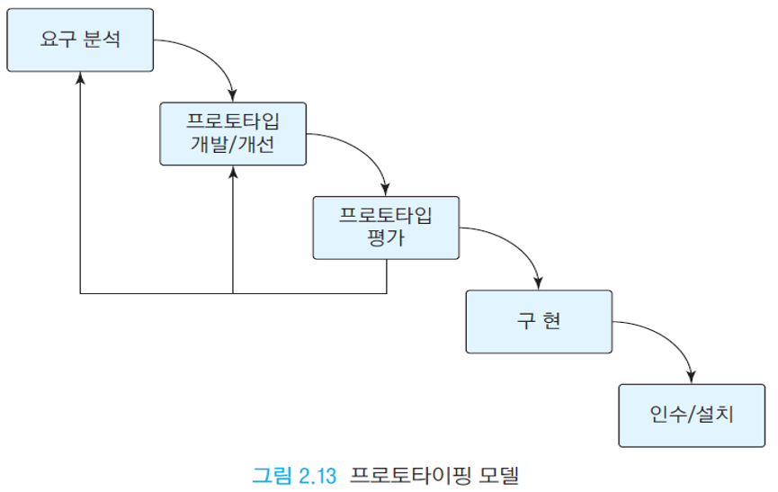

# 프로세스와 방법론

# 프로세스
- 어떤 일을 처리하는 순서, 과정
- 함수와 비슷한 입력과 출력의 구조를 가짐
- 소프트웨어공학에서는 `개발의 가이드`라고 볼 수 있음 (시행착오 감소)

## 만약 프로세스 없이 개발한다면?
- code-and-fix 방식 (설계 x)
- 소프트웨어의 크기가 커지면 힘들어지는 방식 (초반에는 잘 동작하는 것 처럼 보이지만, 기반이 약하기 때문에 갈수록 더 힘들어짐)
- 그러므로 체계적인 규칙이 필요함

# 프로세스 vs 방법론
## 프로세스
- `무엇`을 할것인지
- 단계적인 과정 (각 단계는 다른 방법론으로 구현 가능)
- 패러다임에 독립적
- 종류: 폭포수, 나선형, 애자일 등
## 방법론
- `어떻게` 할것인지
- 구체적인 방법
- 패러다임에 종속적
- 종류: 구조적, 객체지향

# 생명주기
- 소프트웨어도 생명처럼 태어나고 유지하고 죽고 다시 태어나고 하는 과정을 가짐
- 요구분석 > 설계 > 구현 > 테스팅 > 유지보수 > 요구분석 > ...

---

# 모델
## 폭포수 (waterfall)
- 단계: 계획 > 요구분석 > 설계 > 구현 > 테스트 > 운영, 유지보수
- 고전적인(기본적인) 모델
- 각 프로세스를 단계적으로 하나씩 해결해 나아가는 것 (전 단계의 입력이 다음 단계의 출력이 됨)
- 크기가 큰, 중요한 소프트웨어에 적합함
- 하지만 실용적이진 못함
- 모든 단계는 문서화 됨

### 단계
#### 요구분석
- 시스템이 가져아 할 기능, 조건을 설계
- 나중 단계로 갈수록 수정비용이 커지므로 요구분석에서 정교한 설계가 필요

#### 설계
- 요구분석을 설계할 방법
- 설계 범위: 아키텍쳐, 데이터베이스, UI(화면), 상세

#### 구현
- 코드와 테스트로 실제로 프로그램을 만드는 과정

#### 통합 & 테스트
- 구현이 된 프로그램들을 통합하고 테스트
- 통합: 개발자가 담당
- 테스트: QA(Quality Assurance) 담당 (크기: 단위, 통합, 시스템)

### 설치 & 유지보수
- 설치까지가 프로젝트 마무리
- 유지보수는 후에 관리해주는 작업

### 장점
- 단순하여 과정 이해하기 쉬움
- 산출물, 관리 좋음
- 연구와 분석이 설계 틀을 잘 잡음
### 단점
- 수정으로 인한 쓸모없는 문서가 생길 가능성
- 테스트가 후반에 진행되므로 중간에 수정이 어려움

## V
- 각 단계에 테스트를 추가

## 프로토타입
- 핵심적인 기능만을 제작해 미리 완성품을 간단하게 만들어보는 모델
- 시제품을 미리 만들어놓으면 고객과의 정확한 요구 추출, 개발 단계에서 유지보수가 이루어지는 효과
- 적합한 경우: 요구가 불분명할 때, 새로운 기술이 가능한지 테스트해보고 싶을 때
- 순서: 요구분석 > 프로토타입 제작/평가 > 요구분석 > 프로토타입 제작/평가 > ...(상호간이 만족할 때 까지) > 구현 > 인수/설치
### 장점
- 개발자와 고객간의 정확한 요구 도출
### 단점
- 오해, 기대심리 유발
- 관리 어려움

## 진화적
- 빠른 시간안에 개발, 테스트, 릴리즈 과정을 반복하며 시장에 출시해 이윤 얻기
### 장점
- 초기 사용 가능
- 빠르게 시장에 릴리즈 가능
- 고객이 빠르게 확보되므로 에러들을 빠르게 발견 가능
### 단점
- 빠른 개발 중심이므로 설계같은 작업들이 없어 프로젝트가 무너지기 쉬움 (큰 프로젝트에는 부적합)
- 다른 모델과 섞어서 개발하는것이 좋음

## 애자일(agile)
- 고객의 요구에 민첩하게 대응하면서 문제를 해결하는 방식
- 기존의 개발 모델은 개발보다 문서화, 회의 등의 다른 작업에 비용을 많이 들임 (무거움)
- 완전히 code-and-fix방식은 아니고, 기존의 설계 틀과 계획을 토대로 융통성있게 개발하는 방법론 (e.g. 코드자체가 문서화)
- 방식: 익스트림 프로그래밍, 스크럼(SCRUM)
### 특징
- 실용성 중심 (code-and-fix 의 장점 위주)
- 사용자의 소통 중심
- 짧은 주기로 개발
- 폭포수 모델의 특징과 대부분 대조적
### 익스트림 프로그래밍
- 효율적이고 낮은 위험도
- 수많은 변화와 수정
- 테스트 주도 개발 (Test-Driven Development)
- 철학: 소통, 단순성, 피드백
### 스크럼
- 팀 중심적 개발 방법
- 짧은 주기를 반복 
- 정적인 프로세스 대신 경험 중심
- 백로그(backlog) 사용: 개발에 필요한 유저의 요구사항 나열한 목록

---

# 방법론
- 프로세스의 각 작업의 구현 방법
## 구조적
- 문제를 분리와정복(divide and conquer) 원리 적용
- 문제와 해결뱅삭을 구조적으로 다룸
- 각 일을 해결하는 각각의 함수형 구조 (예. C)
## 객체지향
- 문제와 해결방식을 객체(데이터, 메소드)간의 소통으로 다룸
- 데이터와 함수를 가지는 객체지향적 구조 (예. Java)

---

# 유튜브
## IDG.tv | 에자일 개발 프로세스 이해하기 [한글 자막]
- 칸반(KANBAN) 프로세스라고도 부르는 이 방식은 팀간의 역할 분배와 조화를 중심으로 프로젝트를 해결하는 방식
- 고객과의 의사소통으로 재빠른 수정과 함께 개발
- 반복적으로 진행되는 작업들은 자동화시켜놓고 사용
- 한번에 진행이 아닌, 주문이 들어오는대로 개발

## 애자일 3분 요약  
- 애자일 방법은 기업들에게도 전통적으로 분석, 계획들 보다는 실시간으로 빠르게 변화하는 세상, 고객들을 대상으로 전략적 민첩성을 높이는데에도 영향을 줌
- 기업의 사람들간의 조직구조에도 영향을 줌 (계층적 구조가 아닌, 리더도 단지 설계를 하는 팀의 일원으로 보는 것)

## 다 똑같은 애자일은 없다! 우리 조직에 맞는 '애자일' 조직문화 만드는 방법!
- 애자일은 소프트웨어 분야에서 뿐만 아니라, 세상의 흐름(예. 기업)이 바뀌어 가는 방식에 맞춰 빠르게 변화하는것에 빠르게 대응하자의 의미로 나온 방식
- 조직 문화, 인력 설계, 교육 방식 등 많은 부분에 적용됨
- 일하는 사람들부터 즐겁게 일하면서 고객과 소통을 잘 하며 빠르게 대처하면서 제품을 생산하는 방법
- 정보가 모두에게 잘 공유되야 좋음
- 표준화 x, 개별화 o

## [ENG] 5분만에 애자일(Agile)의 대표주자 스크럼(Scrum) 완벽 마스터하기 | 일하는 우리 |
- 스크럼은 애자일 방법론에서도 명확한 방식을 알려줌
- 팀이 중심이 되면서 즐겁게 일을 하며 제품을 생산하고 고객도 만족시키자라는 의식이 뚜렷하게 느껴지는 방식
-대화, 기록들을 하며 서로 소통을 중심으로 일을 하는 방식

## Extreme Programming
- 구성 요소: 페어 프로그래밍, 코드 리뷰, 유닛 테스트, 통합 테스트, 계획, 격려, 존중
- 페어 프로그래밍: 코딩하는 사람과 지켜보고 계획을 짜주는 사람으로 나눠서 2명의 사람들이 번갈아 프로그램을 만드는 방식 (코드 실수가 적어지고, 실시간으로 계획과 구현을 할 수 있음)
- 코드 리뷰: 다른 사람이 만든 코드를 다른 사람이 리뷰하면서 문제점, 개선점 등을 같이 의견을 나누어 보는것
- 유닛 테스트: 큰 문제점을 나중에 발견해서 어렵게 고치기 보다는 작은 코드들을 테스트해보면서 작은 오류부터 없에가는 방식
- 통합 테스트: 개발하 모듈을 각각 적용해보면서 테스트하는 방식 (예. A 테스트 > B 테스트 > A와 B 같이 테스트 ...)
- 격려, 존중: 좋은 제품은 좋은 팀간의 협업도 중요하다!!

## SCRUM VS EXTREME PROGRAMMING | WHAT ARE THE MAJOR DIFFERENCES?
- SCRUM: backlog, item priority, team 이 중심
- Extream Programming(EX): simple, pair programming, testing, integration, refactoring, coding standards, small releases로 구성됨

## The Five Core Values of Extreme Programming (XP) - Compared to Scrum!
- EX vs SCRUM
- Simplicity vs focus
- Communication vs Openness
- Feedback vs Commitment
- Courage vs Courage
- Respect vs Respect

---

# Q&A
1. 폭포수 모델을 도해하세요

2. 폭포수 모형의 단점은?
> 실용적이지 못하고(너무 형식적인 개발 단계, 수정의 어려움) 작은 프로젝트에는 오히려 독이 됨
3. 프로토타이핑 모델을 도해하세요

4. 프로토타이핑 모델이 적합한 경우는?
> 시장에 빨리 진출해야 할 경우, 고객에게 빨리 시제품을 보여줘야 하는 경우, 새로운 기술을 간단히 테스트 할 경우
5. 진화적 모델을 도해하세요

6. 기존 개발 프로세스의 문제점이 무엇이고, 애자일 방법은 무엇인가?
> 기존 개발 프로세스는 너무 형식적인 경향이 많아 프로젝트의 성공을 위해 지키는 형식이 오히려 프로젝트에 독이 되는 경우가 많은 문제가 있음
> 애자일 방법이란 팀간의 소통과 팀과 고객의 소통이 중심이 되어 원칙은 지키되 너무 형식적인것은 피하면서 프로젝트에 민첩하게 반응하며 제작하는 실용주의 방식
7. 애자일 선언은?
> 2001년에 여러사람이 모여 선언한 소프트웨어 제작 방법으로 기존의 무거운 형식보다는 실용적으로 `고객과 소통`, `빠른 반복 개발`, `팀간의 협업`, `자기조직화`, `민첩한 대응`위주의 방법을 더 가치있게 여기는 방식이다
8. 구조적 방법론과 객체지향 방법론을 설명하세요
> 구조적 방법론: 문제를 분리해서 해결하는 방식으로 각 문제를 기능적으로 해결하는 방식 (예. C언어 또는 함수형 패러다임)
> 객체지향 방법론: 문제를 각 객체간의 자료와 행동간의 상호작용으로 해결하는 방식 (예. Java 또는 객체지향형 패러다임)
