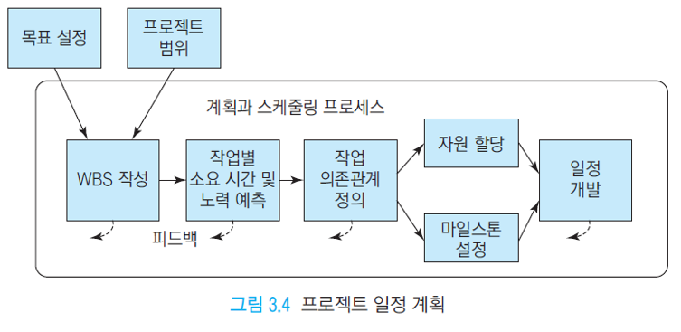
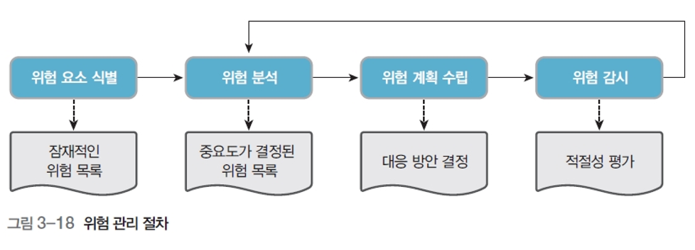

# 프로젝트 관리와 계획
- 프로젝트 관리는 `반복`으로 질과 기능을 높이고 추가하는 것

# 프로젝트
- 일정한 `기간`내에 제품이나 서비스를 만드는 작업

## 특징
- 한시성: 시작과 끝이 존재
- 유일성: 하나의 목표
- 일시성: 참여인력의 일시성
- 한정성: 자원은 끝난 후 해체됨

## 관리 요소
- 계획, 조직, 모니터링, 조정

## 계획
### 문제
- 개발할 것, 개발 방식 결정
- 배경 지식 등 필요
- **사용자가 이해하는 용어** 설명
- 타당성 분석: 경제적, 기술적, 법적

### 스케쥴링

- WBS작성: 시스템을 구조화한 메뉴
- 작업별 소요시간 및 노력 예측: Gantt chart로 정리
- 작업 의존관계: 작업들의 시간적인 의존 관계 정리
- 자원 할당: 사람, 비용 할당
- 마일스톤: 기간 설정

#### 1. 규모 측정 (COCOMO)
- 개발할 범위 설정 (개발자와 사용자의 합의)
#### 2. 작업 분해 (WBS)
- 프로젝트에 대한 필요한 activity들로 분해
- WBS (Work Breakdown Structure) (계층적으로 구조화된 메뉴 시스템) 방법 사용
#### 3. 작업간의 의존관계 (CPM (Critical Path Method))
- CPM: 최소한으로 필요한 작업들의 그래프 관계
- CPM network의 장점: 일정 파악 쉬움, 병행 작업 계획, 시뮬레이션
- 하지만 CPM은 정확한 예측이 필요
#### 4. 일정 계획(개발) (Gantt chart)
- Gantt chart: 소요 자원의 할당을 표로 정리한 것

## 개발 비용
- 소프트웨어는 인건비가 대부분의 개발비용
- 특징: 다양한 분야, 다양한 개발자, 어려운 자동화
- 명확한 개발비용 산출의 어려움

### 예측
- 과거의 데이터와 단계적인 산정 방법 사용
#### 예산
- 인건비: 일/월 기초
- 직접 경비: 여비, 재료비, 인쇄비
- 간접 경비: 팀 관리 비용

### 측정방법
#### 상향식 (Bottom-up)
- 작은 부품들의 단가부터 정해서 위로 올라가며 전체 가격을 정하는 방법 (WBS 기반)
##### 기법 예시
> ##### 코드 라인 수 (LOC)
> - 코드 라인 기반
> - 예시 모델: COCOMO (프로젝트 데이터의 통계 기반 모델)
> ##### 단계별 노력
> - 생명주기의 단계 노력 기반

#### 하향식 (Top-down)
- 전제 시스템의 모델을 기반으로 가격 정하는 방법
##### 기법 예시
> ##### 전문가 판단
> - 전문가의 경험에 의존한 판단
> - 정확하지 못함
> ##### 델파이
> - 여러 전문가들의 의견 조합

## 팀 조직
- 만드는 프로젝트에 따라 다른 구성이 필요
- `직능별`: 부서 별로 조직이 되어 작업 수행
- `프로젝트`: 프로젝트 별로 구성되어 있는 팀 (결속력이 높고 주로 사용되는 방식)
- `매트릭스`: `직능별`과 `프로젝트`를 합친 구조
- `애자일`: 팀원들이 중심으로 진행되는 융통성 있는 조직 (고객 친화적)

## 실행 & 모니터링
- 실제로 테스트 후 모니터링 후 수정 후 다시 테스트 등의 작업을 거쳐 소프트웨어를 점검하는 단계
### 모니터링
- 일정 관리
- 위험(비용, 상황 등) 분석, 관리
- 프로젝트 계획서 작성 ()

# 정리
- 소프트웨어 공학은 단순한 학문에 대한 이론이 아닌, `현실의 고객과 제작사 간의 관계`, `제품 개발 단계`, `팀`, `계획` 등의 많은 분야를
 폭 넓게 다루기 때문에, 공식같은 작은것들을 외우기 보다는 큰 숲을 봐서 흐름을 이해해야 좋음

---

# Q&A
1. 프로젝트의 정의와 특징은?
> 정의: 일정 기간내에 제품 또는 서비스를 만드는 작업
> 특징: 한시성, 유일성, 일시성, 한정성
2. 프로젝트에서 타당성 분석 3가지는?
> 경제적, 기술적, 법적
3. 프로젝트 일정 계획을 도해하세요

4. 일정 계획 작업의 순서는?
> 1. 규모 측정
> 2. 작업 분해
> 3. 작업간의 의존관계
> 4. 일정 계획
5. 간트 차트란?
> 소요 자원의 할당을 표로 정리한 것
6. 프로젝트 비용을 예측하는 2가지 방법은?
> 상향식(bottom-up), 하향식(top-down)
7. 델파이 기법이란?
> 여러 전문가의 의견을 종합해서 프로젝트 비용을 산정하는 방법
8. 직능별 조직, 프로젝트, 매트릭스 조직을 비교하면?
> 직능별: 기능별로 조직되서 작업
> 프로젝트: 프로젝트 별로 조직되어 작업
> 매트릭스: 직능별과 프로젝트를 섞은 방식으로 필요할 때 프로젝트 팀의 인원이 해당 직능(기능) 부서에 가서 도와줄 수도 있음
9. 위험 관리 절차를 도해하면?

---

# 유튜브
## 폭포수처럼 개발하는 방법이 있다? - 폭포수 모델
- 폭포수처럼 각 단계를 거치며 개발하는 방식
- 장점: 많은 적용 사례, 이해 용이, 산출물 관리
- 적합한 경우: 단순한 요구(변경 x), 난이도 낮을 떄, 유사 경험
## 폐기할 소프트웨어를 일부로 만든다고? - 프로토타이핑 모델
- 미리 시제품을 제작하여 고객에게 미리 보여줘 고객의 정확한 요구사항, 추가적인 요구사항을 주고 받을 수 있음
- 중간에 수정할 기회를 줄게 할 수 있는 장점
- 오해를 잃으킬 수 있는 단점
- 실험적: 시제품 폐기 / 진화적: 시제품 기반 개발
## 소프트웨어가 진화를 한다고? - 진화적 개발 모델
- 핵심 기능을 개발 후 잦은 릴리즈와 수정을 반복하는 빠른 개발 모델
- 고객와의 소통을 중시하며 지속적으로 제품을 진화해 나가는 방식 (반복적 개발모델과의 차이)
## 6분 만에 알려주는 소프트웨어 제작 과정
- 컴퓨터는 기계어로 동작
- 소프트웨어 엔지니어는 기계어로 바꿔주는 프로그래밍 언어로 작성
- 프로그래밍 언어는 컴파일러 또는 인터프리터로 기계어로 바꿔줌
- 큰 프로젝트는 버전관리 도구를 사용해서 관리
- 디버깅등을 통해 오류 수정
## ┗ [체크문제-SE-02강] 프로젝트 관리, 비용산정, 조직구성
- 프로젝트 관리: 주어진 기가내 최소 비용으로 사용자를 만족시키는 시스템 개발
- 고객관리는 프로젝트 관리 관리 대상 x
- 생산물은 프로젝트 관리 관리 대상 x
- 중요 요소: 사람, 문제, 프로세스
- 예측: 비용, 일정, 품질
## 프로젝트 매니저 PM이 되려면, 어떻게 하면 될까요? | Guest. 맥비 이일구님
- 프로젝트의 요소: 비용, 일정, 품질(품질은 인력으로 볼 수도 있음 (소프트웨어는 대부분 사람이 제작하기 때문))
- PM (Project Manager): 프로젝트를 효율적으로 관리하고, 산출물을 낼 수 있는 사람
- PM은 기본적인 기술, 도메인은 스스로 공부해야 함 (얕지만 넓게)
- PM와 기획자 차이: 기획자는 제품 큰 그림 위주, PM은 프로젝트 개발에 있어서 인력, 위험, 산출물 등 세세한 방법을 다룸
## 프로젝트 매니저 PM이 되려면, 어떻게 하면 될까요? | Guest. 맥비 이일구님
- 진척률 체크: 세세하게 팀장들에게 체크해야 함 (허위보고를 막기 위해)
- 리스크 관리: 발생될 수 있는 것들을 미리 예측해보면 좋음
- PM은 권한이 많은 만큼 책임을 잘 져야 하기 때문에 작업을 세세히 관리해야 함
