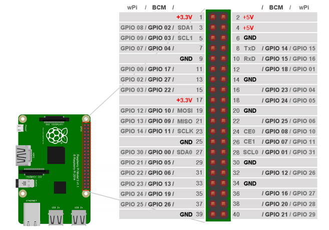

- 모든 컴퓨터 동작은 클락(제너레이터)이 심장 박동을 통해 작동함 (예. 컴퓨터에 USB꽂으면 컴퓨터의 클락 제너레이터가 USB에 신호를 줘서 register에 값을 쓰기/읽기를 통해서 쉬프트로 동작함)

# 라즈베리파이 GPIO

- 칩을 만든 제조사 (wPi, BCM)마다 디지털 포트와 물리포트 연결되는것이 다른것을 알고 있어야 함
- 각 포트는 미리 용도가 정해져 있음 (예. 8, 10번핀은 UART 전용 포트: 칩을 만든 제조사가 칩과 IO핀을 미리 연결해놓은 것)
- GPIO핀 개수: 26개
- GPIO 입출력 신호: 3.3V (5v전용 센서 많으므로 주의)
- GPIO extension board를 raspberrypi board에 연결할 때 바깥쪽으로 연결되게 꽂

---

- 인터럽트가 발생하면 PC와 기타 레지스터값들을 프로세스의 스택메모리에 저장하고 다시 불러와서 사용함
---

# 10-30
**모터**  
- 코일에 전기를 흘려서 미리 들어있는 자석을 힘으로 밀어내는것으로 됨
- 모터안에 자석과 브러쉬가 촘촘히 더 자주 밀어낼 수 있게 되서 더 강해짐 (가끔 비행기 프로펠러나 경운기 모터를 처음에 돌려주는 이유가 일정 회전량이 있어야 힘을 연속적으로 계속 받을 수 있어서???)
- 자기장, 전력, 힘(물리: 회전)중 2개가 만족되면 나머지 1개는 만들어진다
- 트랜지스터는 증폭기 역할도 하지만, 스위치 역할(여러개 연결해서 모터의 회전방향 조절가능)도 함
- 리튬이 배터리로 사용되는 이유: 모든 물질은 분자로 이루어져있고 분자는 양성자와 전자로 이루어져있고 리튬은 전자가 3개인데 가장 밖에 있는 1개가 금방 떨어져나가서 그거를 충천하는식으로 사용가능
- 분자는 양성자와 전자로 이루어짐, 같은것끼리는 밀고 다른것은 서로 당김. 그래서 사람의 몸도 전자기력 관련된 힘에 영향을 받을 수 밖에 없음

- 인간은 전자기력만 제어할 수 있음: 뇌 신경계에서 전기를 생성해서 근육에게 신호를 줌 (강력, 약력, 중력은 제어 불가능)

# 1106
- 기계어를 실행할 땐, 제어장치안에 PC가 일어들여와서 해석한다음 실행한다
- D.M(Data Memory)에 CPU안에서 실행하는 메모리들이 쌓인다??
- CPU안에 있는 것들은 대부분 레지스터를 각각의 용도로 사용하는 것
- ACC(ACCMulator)는 더한 값을 자신 레지스터에 저장시켜 놓음
- 보통 CPU가 n비트라고 하면 내부에 레지스터들이 대부분 n비트이므로
- 인터럽트가 발생하면 서비스루틴이 작동해서 모든 레지스터들의 값을 메모리 stack에 push하고, 나중에 돌아올땐 pop을 한다
- 전이중 반이중은 같은 선으로 쓰느냐, 2개의 선을 쓰느냐에 따라 다름 
- 자동차에서 쓰는 CAN은 보통 TCP/IP 4계층에서 Data Link계층에서 동작
- 블루투스의 통신부분이 UART처럼 RX, TX로 연결해놓으면 동작함
- 블루투스는 대역폭이 2.4GHz 부근이다 (WIFI와 비슷), 간섭을 피하기 위한 알고리즘이 있다

---

- 직류는 저장할수있고 교류는 저장할수없음 (발전기는 교류 범위내에서 생산)
- ups 직류를 교류로 변환 
- 인버터는 직류 교류 변환함 (전압과 주파수 변환)
- 브레이크 밟으면 교류 생성이 되는데 인버터 사용해서 직류로 변환해서 저장