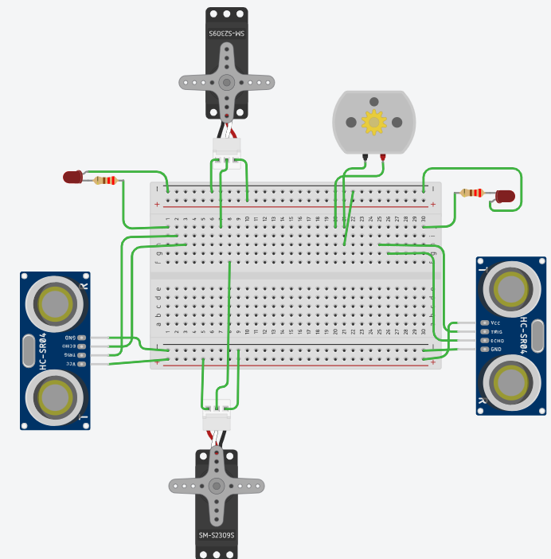

# 인터페이스 회로 구성도


# 원격제어(블루투스, 웹제어)
서버 `/control`주소로 뒤에 인자(예. `/control?brake=5`)를 보내서 원격으로 rcar를 제어합니다.
```py
@app.route('/control')
def control():
    action = request.args['action']
    if action == 'power':
        power = bool(request.args['power'])
        car.power(power)
    elif action == 'auto_drive':
        toggle = bool(request.args['toggle'])
        mode = request.args['mode']
        car.auto_drive(toggle, mode)
    elif action == 'accelerate':
        amount = int(request.args['amount'])
        car.accelerate(amount)
    elif action == 'brake':
        amount = int(request.args['amount'])
        car.brake(amount)
    elif action == 'turn':
        angle = int(request.args['angle'])
        car.turn(angle)
    elif action == 'gear':
        gear = request.args['gear']
        car.gear(gear)
    else:
        print(f"알수없는 명령: {action}")
        return 'not exist action', 400
    return 'ok', 200
```

# 구성도 및 코딩 설명
### 구성도
- DC 모터: 자동차 엔진
- 초음파 2개: 앞, 뒤 거리 센서
- 서보모터 2개: 핸들, 모터 방향제어 (원래 모터 방향제어 하는 회로를 두어야 하는데 어려워서 서보모터가 대신 물리적으로 해주는 상상...을 했습니다)
- LED 2개: 앞, 뒤 라이트

### 코드 설명
**폴더 설명**  
- `rcar/systems` 폴더: DC모터와 LED등의 모듈 상세 구현 코드
- `rcar/car`: 자동차 부품관점 코드

**소스파일 설명**  
- `pin.py`: 핀 연결 번호를 위한 파일
- `car.py`: 자동차의 기본 동작을 관리하는 곳 (시동, 엑셀, 브레이크, 회전)
- `system.py`: 자동차 부품을 관리하는 곳 (하드웨어 모듈과 실제 연결되는 코드)
- `status.py`: 자동차의 상태를 관리하는 곳
- `auto_driving.py`: 자동차의 동작과 시스템을 활용하여 자율주행 패턴을 관리하는 곳
- `factory.py`: 자동차 객체 생성을 관리하는 곳

**car.py**  
자동차의 기본적인 동작(시동, 엑셀, 브레이크)을 구현한 코드입니다.
```py
from rcar.car.system import CarSystem
from rcar.car.status import CarStatus
from rcar.car.auto_driving import AutoDriving

class Car:
    def __init__(self, car_system):
        self.system = car_system
        self.status = CarStatus()
        self.auto_driving = AutoDriving(self)

    def power(self, power):
        print(f"시동: {power}")
        self.status.power = power

        if power:
            # 자율주행 쓰레드 시작 (처음모드: IDLE)
            self.auto_driving.running = True
            self.auto_driving.start()
        else:
            # 자율주행 쓰레드 종료
            self.auto_driving.running = False

    def auto_drive(self, toggle, mode):
        print(f"자동주행 설정: {toggle}, 모드: {mode}")
        self.auto_driving.running = toggle
        self.auto_driving.mode = mode

    def accelerate(self, amount):
        print(f"가속: {amount}")
        self.status.speed += amount
        self.system.engine.rotate(self.status.speed, self.status.gear == 'R')

    def brake(self, amount):
        print(f"감속: {amount}")
        self.status.speed -= amount
        self.system.engine.rotate(self.status.speed, self.status.gear == 'R')

    def turn(self, angle):
        print(f"회전: {angle}")
        self.status.angle = angle
        self.system.handle.rotate(self.status.angle)

    def gear(self, gear):
        print(f"기어변경: {self.status.gear} -> {gear}")
        self.status.gear = gear

    def status(self):
        stat = str(self.status) + " | " + str(self.auto_driving)
        return stat
```


**status.py**  
자동차의 다양한 상태를 관리하는 클래스
```py
class CarStatus:
    def __init__(self):
        self.power = False
        self.speed = 0
        self.angle = 0
        self.gear = 'N'  # N: 가만히 있기, D: 전진, R: 후진

    def __str__(self):
        # 예시: 시동: False, 속도: 0, 각도: 0, 기어: N
        return f"시동: {self.power}, 속도: {self.speed}, 각도: {self.angle}, 기어: {self.gear}"
```


**system.py**  
자동차 부품을 관리하는 곳 (하드웨어 모듈(DC모터 등)과 실제 연결되는 코드)
```py
class CarSystem:
    def __init__(self, engine,
                 f_colli_detector, b_colli_detector, engine_director,
                 head_light, back_light, handle):
        self.engine = engine
        self.f_colli_detector = f_colli_detector
        self.b_colli_detector = b_colli_detector
        self.engine_director = engine_director
        self.head_light = head_light
        self.back_light = back_light
        self.handle = handle

    def __str__(self):
        return f"CarSystem(engine={self.engine}, f_colli_detector={self.f_colli_detector}, " \
               f"b_colli_detector={self.b_colli_detector}, engine_director={self.engine_director}, " \
               f"head_light={self.head_light}, back_light={self.back_light}, handle={self.handle})"
```


**auto_driving.py**  
자동차의 동작과 시스템을 활용하여 자율주행 패턴을 관리하는 곳
```py
# rcar.systems에 있는 모듈 각각 함수 불러오기
from rcar.systems.dc_motor import *
from rcar.systems.servo_motor import *
from rcar.systems.ultrasonic import *
from rcar.systems.led import *


import threading
import time

class AutoDriving(threading.Thread):
    def __init__(self, car):
        self.car = car
        # IDLE: 아무것도 안하는 모드
        # LINE: 앞뒤로 출동만 안하게 하는 모드
        self.mode = "IDLE"
        self.running = False

    def drive(self):
        while self.running:
            if self.mode == "LINE":
                self.line_drive()

    def line_drive(self):
        """
        단순하게 앞뒤로 움직이면서, 앞 뒤 센서가 감지되면 기어를 변경하는 모드

        - 웹제어 RC카의 초음파센서에서 일정거리 이내(예, 10cm)에 물체가 있는 것으로 감지되면 DC모터를 정지시키고, 일정거리 보다 멀리 물체가 있는 것으로 감지되면 DC모터를 정방향으로 회전
        - 웹제어 RC카의 초음파센서1에서 일정거리 이내에 물체가 있는 것으로 감지되면 서보모터를  정방향으로 회전시키고, LED1을 ON
        - 초음파센서2에서 일정거리 이내에 물제가 있는 것으로 감지되면 서보모터를 역방향으로 회전시키고 LED2을 ON
        - LED1과 LED2의 상태를 같은 네트워크상에 있는 다른 기기(컴퓨터, 스마트폰)에서 LED상태 감시 가능(플라스크 웹 프로그램 작성)
        """
        system = self.car.system

        fs = system.f_colli_detector
        bs = system.b_colli_detector

        # 앞 센서 감지
        if fs.distance() <= 10:
            # 정지
            speed = self.car.status().speed
            self.car.brake(speed)

            # 기어 R로 변경
            self.car.gear('R')

            # LED1 ON
            system.head_light.on()

        # 뒤 센서 감지
        if bs.distance() <= 10:
            # 정지
            speed = self.car.status().speed
            self.car.brake(speed)

            # 기어 D로 변경
            self.car.gear('D')

            # LED2 ON
            system.tail_light.on()

    def wall_guard_drive(self):
        """
        벽에 붙어서 오른쪽으로 정찰하는 모드

        - 항상 직진
        - 앞에 10cm이내로 벽이 있으면 우회전
        """
        pass

    def __str__(self):
        # 예시: 모드: IDLE, 상태: False
        return f"모드: {self.mode}, 상태: {self.running}"
```

# 느낀점
생각보다 자동차에 엄청나게 많은 부품과 기술들이 들어간다는 사실을 알게되어서 놀라웠습니다.